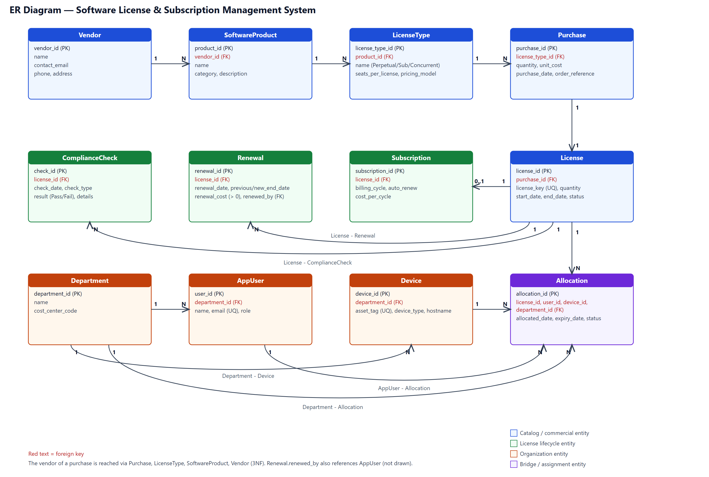
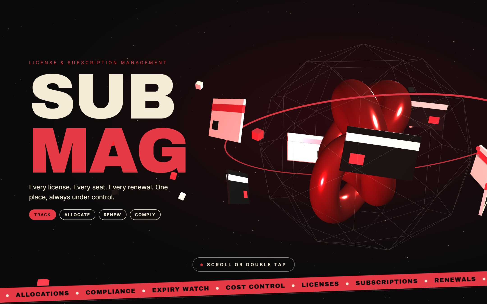
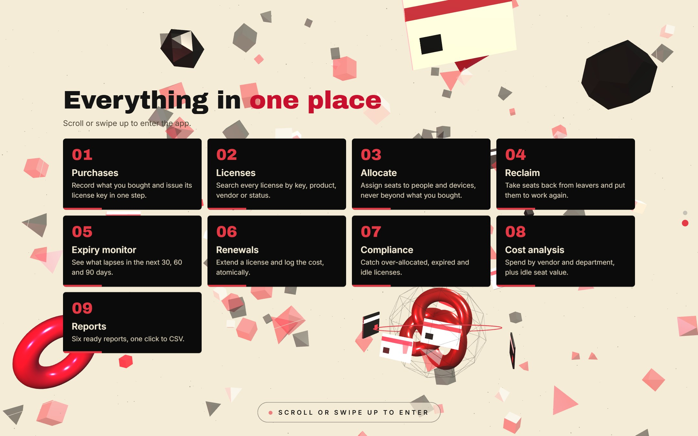
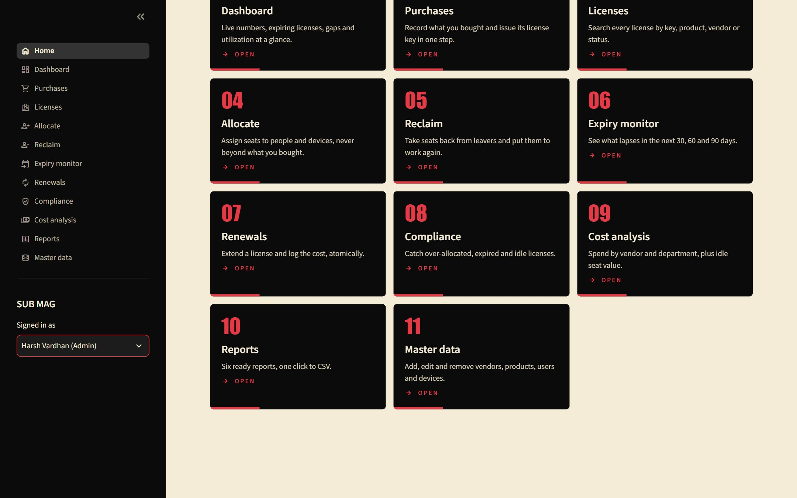
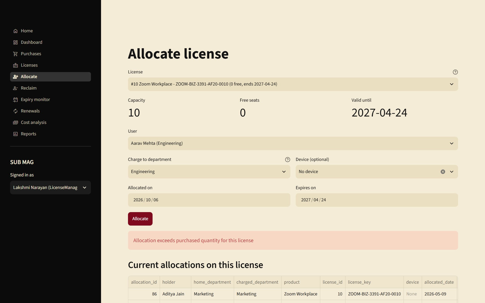
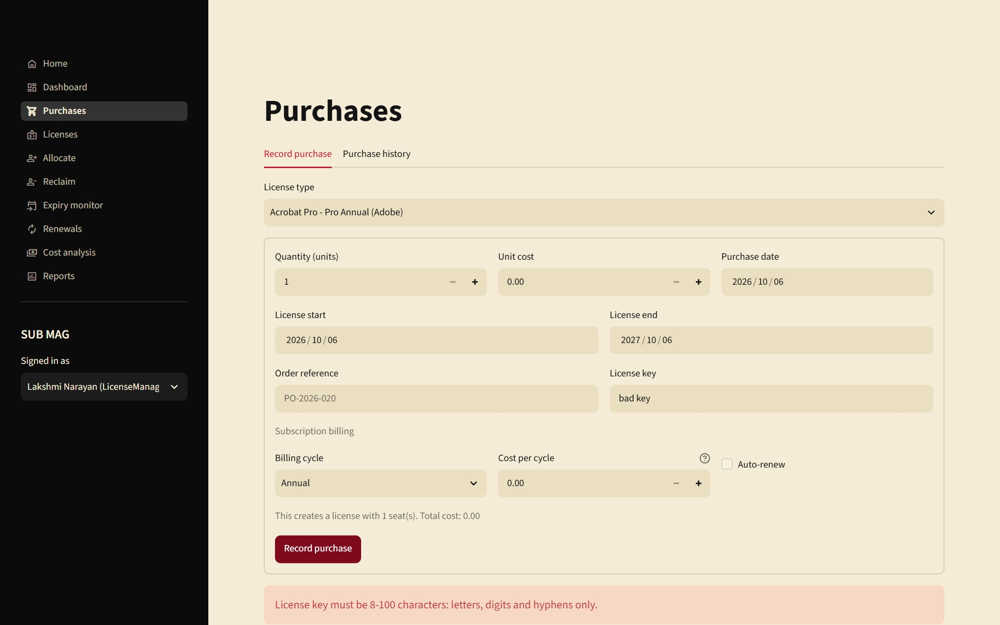
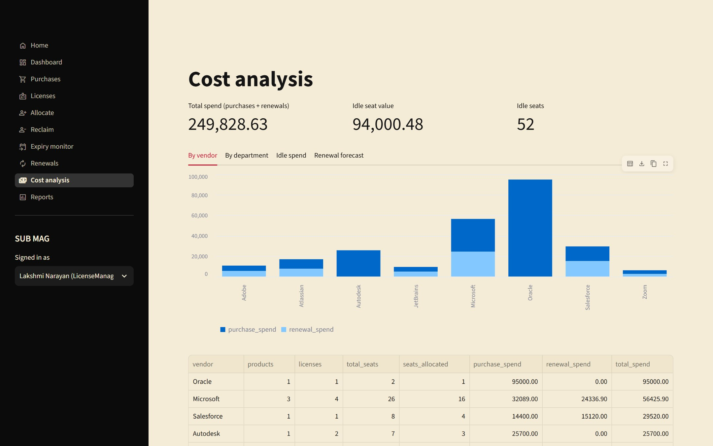

<!--
HOW TO USE THIS FILE
- Slides are separated by a line containing only ---
- The HTML comments under each slide are speaker notes (shown by Marp, ignored by Pandoc).
- To PowerPoint with Pandoc, run from the Presentation/ folder (so image paths resolve):
      pandoc PRESENTATION.md -o PRESENTATION.pptx
- To PowerPoint/PDF with Marp (keeps the red / black / cream theme):
      npx @marp-team/marp-cli PRESENTATION.md --pptx --allow-local-files
      npx @marp-team/marp-cli PRESENTATION.md --pdf  --allow-local-files
- Fill every [PLACEHOLDER] (names, roll numbers, faculty).
-->

<!-- _class: title -->

# SUB MAG

## Software License & Subscription Management System

Project 40 · Database Management Systems · Semester 3

[Member 1: Shreyash Singh, roll no.] · [Member 2, roll no.] · [Member 3, roll no.]

Faculty: [Faculty Name]

<!-- Say: we built a database and a web app that keep track of every software license a company owns. -->

---

## The problem

- Licenses **expire unnoticed**
- Seats are handed out **beyond what was purchased**
- Expired licenses stay **assigned to people**
- Paid seats sit **unused**
- Nobody knows the **real software spend**

> Spreadsheets cannot stop any of this. A database with rules can.

<!-- Say: every company with software has this problem; audits and wasted money are the cost. -->

---

## Our solution

**One normalized MySQL database + a web app (SUB MAG)**

- Models vendors, products, licenses, subscriptions, departments, users, devices, allocations, renewals, compliance checks
- Business rules are enforced **inside the database**, not just in the app
- Role-based web app for purchases, allocation, renewal, compliance, cost and reports

<!-- Say: the key idea is that even if someone bypasses the app, the database still refuses bad data. -->

---

## Who uses it

| Role | What they do |
|---|---|
| Admin | Manage master data, see everything |
| License manager | Purchases, allocate, reclaim, renew, monitor expiry |
| Compliance officer | Compliance checks, gaps, utilization |
| Manager | Read-only cost and reports |
| Employee | Basic dashboard |

<!-- Say: each role only sees the pages it needs; the Home page shows a card for each. -->

---

## ER diagram: 12 entities

<!-- Say: parent on the 1 side, child on the N side. Purchase creates one License; a License is split into many Allocations. -->

---

## Normalization to 3NF (and BCNF)

**Found and fixed in our first draft**

- Vendor and product stored on `purchase` → removed (reached through license type)
- `total_cost` stored → removed (computed)
- Duplicate subscription dates → removed
- Free-text `renewed_by` → foreign key to user
- Repeating groups (`license_key_1..n`) → separate tables

**Result:** every determinant is a key, so the design is in **BCNF**

<!-- Say: show one example, such as vendor_id on purchase being a transitive dependency. -->

---

## What is in the database

| Item | Count |
|---|---|
| Tables | 12 |
| Triggers (business rules) | 2 |
| Stored procedures | 2 |
| Views (the 6 required reports) | 6 |
| Extra indexes | 10 |
| Queries in the query library | 36 |

Constraints used: `PRIMARY KEY`, `FOREIGN KEY`, `UNIQUE`, `NOT NULL`, `CHECK`, `DEFAULT`

---

## Five business rules, enforced by the database

| Rule | How |
|---|---|
| Unique license keys | `UNIQUE` |
| Allocation within purchased quantity | Trigger |
| Valid allocation period | `CHECK` + trigger |
| No assignment of expired licenses | Trigger |
| Positive renewal cost | `CHECK` |

<!-- Say: CHECK cannot look at other rows, so the quantity and expiry rules use triggers that lock the license row to stay safe under concurrent use. -->

---

## Live demo

1. Intro: 3D scene, explode into the feature page, scroll into the app
2. Home: cards for this user's role, tap one to jump in
3. Allocate on a **full** license → database refuses
4. Expiry monitor, cost analysis, reports

▶ Video: `Presentation/demo/demo.mp4` (also in the repo README)

<!-- Do the demo live if possible; the video is the backup. -->

---

## UI: animated introduction

 

Red · black · cream theme. Scroll, swipe or double tap to move on.

---

## UI: role-based Home

The Admin sees all 11 pages as cards; other roles see only theirs.

---

## Rules in action

 

Left: the database trigger stops an over-allocation. Right: input validation.

<!-- Say: errors are plain sentences, never stack traces. -->

---

## Reports and analysis

Six reports (expiry, utilization, compliance gaps, renewal cost, department allocation, vendor portfolio) with CSV export. Cost analysis shows idle seat value and renewal forecast.

---

## How it is built

| Layer | Technology |
|---|---|
| Interface | Streamlit (Python), Three.js intro |
| Services | Python modules: purchases, allocations, renewals, compliance, reports |
| Data access | `mysql-connector-python`, bound parameters |
| Database | MySQL 8.0 (InnoDB) |

- Multi-step changes use **transactions** (commit all or roll back all)
- Database errors are translated into friendly messages
- About 2,000 lines of Python and 1,000 lines of SQL

---

## Testing

| Level | Test cases | Passed |
|---|---|---|
| Database rules and constraints | 14 | 14 |
| Service layer | 59 | 59 |
| User-interface interactions | 17 | 17 |
| **Total** | **90** | **90** |

Plus 48 page renders (12 pages × 4 roles) with no errors. A failed purchase leaves no leftover rows.

---

## What we achieved

- A complete, normalized, rule-enforcing database
- Realistic sample data with built-in problem cases (over-allocated, expired-in-use, unused, expiring soon)
- A working app covering every required workflow
- Documented, tested and reproducible

---

## Future enhancements

- Real login (hashed passwords or single sign-on)
- E-mail alerts for expiring licenses
- Bulk CSV import
- Audit trail of every change
- Auto-discovery of installed software
- REST API and Docker packaging

---

<!-- _class: title -->

# Thank you

## Questions?

Code, report and demo: **github.com/Maze006/DBMS_COURSE_PROJECT**

[Member 1] · [Member 2] · [Member 3]
