<!--
HOW TO USE THIS FILE
- Convert to Word later with Pandoc, run from the Report/ folder so image paths resolve:
      pandoc PROJECT_REPORT.md -o PROJECT_REPORT.docx --toc --toc-depth=2
  (add --reference-doc=your-template.docx to apply your institute's fonts/margins).
- Fill in every [PLACEHOLDER] in square brackets (names, roll numbers, faculty, institute,
  contribution table, GitHub link). Search for "[" to find them all.
- All query outputs, tables and test results were captured from the running system on 2026-10-06.
  Dates in the outputs are relative to that day (the sample data is generated relative to the run date).
-->

# 1. Cover Page

&nbsp;

**WOXSEN UNIVERSITY**

**SOT**

&nbsp;

## DESIGN AND IMPLEMENTATION OF A DATABASE MANAGEMENT SYSTEM FOR SOFTWARE LICENSE AND SUBSCRIPTION MANAGEMENT SYSTEM

**Project 40 · Application name: SUB MAG**

&nbsp;

**Course:** Database Management Systems (DBMS) – Semester 3

**Faculty:** DR KIRAN MAYEE 

**Academic year:** 2026–27

&nbsp;

**Submitted by**

| S. No. | Name | Roll number |
|---|---|---|
| 1 | Shreyash | 25WU0101130 |
| 2 | SHIVAM | 25WU0101129 |
| 3 | SAMBHAJI | 25WU0101120 |
| 4 | RAMA SUDESHNA | 25WU0101104|
&nbsp;

---

# 2. Abstract

Organizations buy many licensed products and subscriptions and share them across departments. When this is tracked in scattered spreadsheets, licenses expire unnoticed, seats are handed out beyond what was purchased, expired licenses stay assigned to people and devices, and nobody can say what the organization really spends on software.

This project designs and implements a relational database, and a web front end named **SUB MAG**, that centralizes software license and subscription management. The conceptual model covers twelve entities: vendors, software products, license types, purchases, licenses, subscriptions, departments, users, devices, allocations, renewals and compliance checks. It was converted to a relational schema and normalized to Third Normal Form (the final design also satisfies BCNF). The database is implemented in MySQL 8.0 with primary keys, foreign keys, `UNIQUE`, `NOT NULL`, `CHECK` and `DEFAULT` constraints, two triggers, two stored procedures, six reporting views and ten supporting indexes.

The five business rules required by the problem statement (unique license keys, allocation within purchased quantity, valid allocation period, no assignment of expired licenses, and positive renewal values) are enforced **inside the database**, so they hold no matter which application writes the data. A Python and Streamlit application supports purchase recording, license allocation, reclaim, expiry monitoring, renewal, compliance checking, cost analysis and reporting, with role-based access, input validation, friendly error messages and transactions for multi-step operations. The system was verified with 90 automated test cases at database, service and user-interface level, summarized in Section 13.

**Keywords:** license management, subscription management, MySQL, normalization, triggers, constraints, Streamlit, compliance.

---

# 3. Introduction and Problem Statement

## 3.1 Background

Almost every organization depends on licensed software: office suites, development tools, design applications, databases and cloud subscriptions. Each product is bought from a vendor under a license type (perpetual, annual subscription, concurrent, per-user) for a fixed number of seats and a fixed period. Seats are then assigned to users and devices in different departments, and subscriptions must be renewed before they lapse.

## 3.2 Problem statement

Without centralized control the following problems appear:

1. **Unnoticed expiry.** Licenses and subscriptions lapse and work stops, or software keeps running unlicensed.
2. **Over-allocation.** More seats are handed out than were purchased, which is an audit and legal risk.
3. **Stale assignments.** Expired or revoked licenses remain assigned to users and devices.
4. **Idle spend.** Paid seats sit unused while other teams run short.
5. **No cost visibility.** Renewal costs, department spending and vendor concentration cannot be reported reliably.

The problem is therefore to **design and implement a relational database management system for software license and subscription management**, to enforce the business rules in the database, to populate it with realistic data, to provide queries, views and reports, and to build a small application on top of it.

## 3.3 Proposed solution

The proposed solution is a normalized MySQL database that models vendors, products, license types, purchases, licenses, subscriptions, departments, users, devices, allocations, renewals and compliance checks, together with the SUB MAG web application. Integrity rules live in the schema (constraints and triggers); reporting logic lives in views; operational workflows live in a Python service layer that wraps multi-step changes in transactions.

---

# 4. Objectives and Scope

## 4.1 Objectives

1. Analyse the requirements and identify the entities, attributes, relationships and user roles.
2. Produce an ER model and convert it to a relational schema normalized to 3NF, with functional dependencies and a data dictionary.
3. Implement the database in MySQL with suitable primary keys, foreign keys, `UNIQUE`, `NOT NULL`, `CHECK` and `DEFAULT` constraints.
4. Enforce the key business rules in the database: unique license keys, allocation within purchased quantity, valid allocation period, no assignment of expired licenses and positive renewal values.
5. Populate the tables with realistic sample data and prepare queries using joins, aggregates, nested queries and views for license expiry, utilization, compliance gaps, renewal cost, department allocation and vendor portfolio.
6. Build a front-end application for purchase recording, license allocation, expiry monitoring, renewal, reclaim, compliance checking, cost analysis and reporting.
7. Demonstrate normalization, data integrity, transaction awareness, indexing, input validation and systematic testing.

## 4.2 Scope

**In scope**

- Master data: vendors, software products, license types, departments, users and devices.
- Transactions: purchases, licenses (keys and seat pools), subscriptions, allocations, renewals and compliance checks.
- Six reports: license expiry, utilization, compliance gaps, renewal cost, department allocation and vendor portfolio, with CSV export.
- A web application with role-based access, search, validation and error handling.

**Out of scope**

- Automatic discovery or installation of software on devices.
- Payment processing and invoicing integration.
- Enterprise single sign-on and password authentication (the application selects a user and role from the database instead).

## 4.3 Users and roles

| Role | Responsibilities | Pages available |
|---|---|---|
| Admin | Maintain master data and see everything | All 12 pages |
| License manager | Record purchases, allocate and reclaim licenses, process renewals, monitor expiry | Home, Dashboard, Purchases, Licenses, Allocate, Reclaim, Expiry monitor, Renewals, Cost analysis, Reports |
| Compliance officer | Run compliance checks and review gaps, utilization and cost | Home, Dashboard, Licenses, Expiry monitor, Compliance, Cost analysis, Reports |
| Manager (department head) | Read-only cost and report views | Home, Dashboard, Cost analysis, Reports |
| Employee | Basic read-only view | Home, Dashboard |

## 4.4 Functional requirements

| ID | Requirement |
|---|---|
| FR1 | CRUD for vendors, software products, license types, departments, users and devices |
| FR2 | Record a purchase and create its license with a unique key and validity window |
| FR3 | Attach subscription billing details (cycle, auto-renew, cost per cycle) to a license |
| FR4 | Allocate a license seat to a user, optionally on a device, charged to a department, for a valid period |
| FR5 | Reject allocation when the license is expired or revoked, fully used, or the period falls outside the license validity |
| FR6 | Reclaim an allocation, freeing the seat while keeping the history |
| FR7 | Renew a license: extend its end date and record the renewal with a positive cost |
| FR8 | Expiry monitoring for the next 30, 60 and 90 days and for already expired licenses |
| FR9 | Compliance checking for over-allocation, expired-but-in-use and unused licenses, with results stored |
| FR10 | Cost analysis per vendor, department and product; renewal forecast; idle seat value |
| FR11 | Six reports with CSV export |
| FR12 | Search and filter licenses, allocations, purchases and master data |
| FR13 | Validate all input and show clear messages for rule violations |

## 4.5 Business rules

| ID | Rule | Enforced by |
|---|---|---|
| BR1 | License keys are unique | `UNIQUE` constraint on `license.license_key` |
| BR2 | Active allocations of a license never exceed its purchased quantity | Trigger on `allocation` |
| BR3 | An allocation has a valid period (end after start, inside the license window) | `CHECK` constraint plus trigger |
| BR4 | Expired or revoked licenses cannot be assigned | Trigger on `allocation` |
| BR5 | Renewal cost is positive | `CHECK` constraint on `renewal.renewal_cost` |
| BR6 | A user holds at most one active seat per license | `UNIQUE` index on a generated column |

---

# 5. Software and Hardware Requirements

## 5.1 Software requirements

| Component | Version used | Purpose |
|---|---|---|
| Operating system | Windows 11 Home | Development and testing |
| Database server | MySQL 8.0.46 (InnoDB engine) | Relational database, triggers, views, stored procedures |
| Programming language | Python 3.13.4 | Application and service layer |
| Web framework | Streamlit 1.65.0 | Front end |
| Database driver | mysql-connector-python 26.7.0 | Python to MySQL connectivity |
| Data library | pandas 3.0.6 | Tabular display and CSV export |
| Configuration | python-dotenv 1.2.4 | Reads database settings from `.env` |
| 3D graphics | Three.js r128 (loaded from a CDN) | Animated introduction screens |
| Web browser | Google Chrome (current) | Running the application |
| Command-line client | `mysql` 8.0 client | Loading the SQL scripts |

## 5.2 Hardware requirements

| Item | Minimum | Recommended |
|---|---|---|
| Processor | Dual-core, 2 GHz | Quad-core, 2.5 GHz or better |
| Memory | 4 GB | 8 GB |
| Disk space | 1 GB free | 2 GB free |
| Display | 1280 × 720 | 1920 × 1080 |
| Graphics | Any (software rendering works) | WebGL-capable GPU for a smooth 3D introduction |
| Network | Needed once for the 3D library and fonts | Broadband |

---

# 6. ER Diagram


## 6.1 Entities

| Entity | Purpose | Key attributes |
|---|---|---|
| Vendor | Company that sells software | vendor_id, name, contact_email, phone, address |
| SoftwareProduct | A product sold by a vendor | product_id, vendor_id, name, category, description |
| LicenseType | A way a product is licensed | license_type_id, product_id, name, seats_per_license, pricing_model |
| Purchase | A purchase line for a quantity of one license type | purchase_id, license_type_id, quantity, unit_cost, purchase_date, order_reference |
| License | The purchased pool of seats and its validity window | license_id, purchase_id, license_key, quantity, start_date, end_date, status |
| Subscription | Billing details of a subscription license | subscription_id, license_id, billing_cycle, auto_renew, cost_per_cycle |
| Department | Organizational unit and cost center | department_id, name, cost_center_code |
| AppUser | A person who can hold licenses | user_id, department_id, name, email, role |
| Device | A computer or server a license can be installed on | device_id, department_id, asset_tag, device_type, hostname |
| Allocation | Assignment of one seat to a user (and optionally a device) | allocation_id, license_id, user_id, device_id, department_id, allocated_date, expiry_date, status |
| Renewal | One renewal event of a license | renewal_id, license_id, renewal_date, previous_end_date, new_end_date, renewal_cost, renewed_by |
| ComplianceCheck | The stored result of one compliance check | check_id, license_id, check_date, check_type, result, details |

## 6.2 Relationships

| Relationship | Cardinality | Meaning |
|---|---|---|
| Vendor – SoftwareProduct | 1 : N | A vendor sells many products |
| SoftwareProduct – LicenseType | 1 : N | A product can be licensed in several ways |
| LicenseType – Purchase | 1 : N | A license type can be bought many times |
| Purchase – License | 1 : 1 | Each purchase creates one license (a pool of seats) |
| License – Subscription | 1 : 0..1 | Only subscription-type licenses have billing details |
| License – Allocation | 1 : N | A license is split into many seats |
| License – Renewal | 1 : N | A license can be renewed many times |
| License – ComplianceCheck | 1 : N | A license is checked repeatedly over time |
| Department – AppUser | 1 : N | A department has many users |
| Department – Device | 1 : N | A department owns many devices |
| Department – Allocation | 1 : N | A department is charged for many seats |
| AppUser – Allocation | 1 : N | A user can hold many seats |
| Device – Allocation | 1 : N (optional) | A device can carry many licenses; user-only licenses have no device |
| AppUser – Renewal | 1 : N (optional) | Records who processed a renewal (not drawn in the figure) |

## 6.3 Design decisions

- The vendor of a purchase is **not stored on the purchase**. It is reached through Purchase → LicenseType → SoftwareProduct → Vendor, which avoids a transitive dependency (see Section 7).
- Each purchase creates exactly one license, so seat capacity and validity live on `license`. Splitting a purchase into several licenses would only require relaxing one unique constraint.
- `Allocation.department_id` is the department **charged** for the seat. It can differ from the user's home department (cross-charging), so it is a genuine fact of the allocation and not a redundant copy.

---

# 7. Relational Schema and Normalization

## 7.1 Initial schema (first draft)

The first attempt folded related facts into wide tables. A typical example is a single `PURCHASE_RECORD` table:

```text
PURCHASE_RECORD(purchase_id, purchase_date, quantity, unit_cost,
                vendor_id, vendor_name, vendor_email,
                product_id, product_name, product_category,
                license_type_id, license_type_name,
                license_key_1, license_key_2, license_key_3, ...,
                allocated_user_1, allocated_user_2, ...)
```

Problems: repeating groups (`license_key_1..n`, `allocated_user_1..n`) violate 1NF; vendor and product attributes are repeated on every purchase (update and insertion anomalies); and the table mixes facts of different grain (purchase, vendor, product, allocation).

Decomposing it gave the first relational draft:

```text
VENDOR(vendor_id, name, contact_email, phone, address)
SOFTWARE_PRODUCT(product_id, vendor_id, name, category, description)
LICENSE_TYPE(license_type_id, product_id, name, seats_per_license, pricing_model)
PURCHASE(purchase_id, vendor_id, product_id, license_type_id, quantity, unit_cost, total_cost, purchase_date, order_reference)
LICENSE(license_id, purchase_id, license_key, quantity, start_date, end_date, status)
SUBSCRIPTION(subscription_id, license_id, billing_cycle, subscription_start, subscription_end, auto_renew, cost_per_cycle)
DEPARTMENT(department_id, name, cost_center_code)
APP_USER(user_id, name, email, department_id, role)
DEVICE(device_id, department_id, asset_tag, device_type, hostname)
ALLOCATION(allocation_id, license_id, user_id, device_id, department_id, allocated_date, expiry_date, status)
RENEWAL(renewal_id, license_id, renewal_date, previous_end_date, new_end_date, renewal_cost, renewed_by)
COMPLIANCE_CHECK(check_id, license_id, check_date, check_type, result, details)
```

## 7.2 Normal forms applied

- **1NF:** all values are atomic and there are no repeating groups; every table has a primary key.
- **2NF:** every table has a single-column surrogate primary key, so partial dependencies cannot occur.
- **3NF:** no non-key attribute depends on another non-key attribute. This is where the first draft needed correction.

## 7.3 Functional dependencies

| Table | Functional dependencies |
|---|---|
| vendor | vendor_id → name, contact_email, phone, address |
| software_product | product_id → vendor_id, name, category, description |
| license_type | license_type_id → product_id, name, seats_per_license, pricing_model |
| purchase | purchase_id → license_type_id, quantity, unit_cost, purchase_date, order_reference |
| license | license_id → purchase_id, license_key, quantity, start_date, end_date, status; license_key → license_id |
| subscription | subscription_id → license_id, billing_cycle, auto_renew, cost_per_cycle; license_id → subscription_id |
| department | department_id → name, cost_center_code; cost_center_code → department_id |
| app_user | user_id → name, email, department_id, role; email → user_id |
| device | device_id → department_id, asset_tag, device_type, hostname; asset_tag → device_id |
| allocation | allocation_id → license_id, user_id, device_id, department_id, allocated_date, expiry_date, status |
| renewal | renewal_id → license_id, renewal_date, previous_end_date, new_end_date, renewal_cost, renewed_by |
| compliance_check | check_id → license_id, check_date, check_type, result, details |

Every determinant above is a key (primary or candidate key), which is the BCNF condition. The final design is therefore in **BCNF**, which is stronger than 3NF.

## 7.4 Violations found in the first draft and their fixes

| # | Problem in the first draft | Dependency | Normal form | Fix |
|---|---|---|---|---|
| 1 | `purchase.vendor_id` stored next to `license_type_id` | license_type_id → product_id → vendor_id | 3NF | Removed. The vendor is reached through license_type, software_product and vendor |
| 2 | `purchase.product_id` stored next to `license_type_id` | license_type_id → product_id | 3NF | Removed |
| 3 | `purchase.total_cost` | total_cost = quantity × unit_cost | 3NF (derived value) | Removed. Computed in queries and views |
| 4 | `subscription_start` / `subscription_end` duplicate the license dates | license_id → start_date, end_date | 3NF | Removed from `subscription` |
| 5 | `renewal.renewed_by` as free text | the name depends on a user, not on the renewal | 3NF | Replaced by a foreign key to `app_user` |
| 6 | Vendor and department names copied to child tables | child → parent_id → parent_name | 3NF | Children keep only the foreign key |
| 7 | `license_key_1..n`, `allocated_user_1..n`, `renewal_1..n` | repeating groups | 1NF | Separate tables: license, allocation, renewal |

## 7.5 Deliberate design decisions (not violations)

- **`allocation.department_id` versus `app_user.department_id`.** The first is the department *charged* for the seat, the second is the user's *home* department. A user can be cross-charged to another cost center, so `user_id` does not determine the charged department and no transitive dependency exists. The same reasoning applies to `device.department_id` (owning department).
- **`license.quantity`.** Seat capacity equals `purchase.quantity × license_type.seats_per_license` when the license is created. It is stored so the allocation trigger can check capacity quickly and so a capacity can later be adjusted (for example a vendor true-down) without touching the purchase. The dependency spans tables, so it is not a 3NF violation inside `license`.
- **`license.status`.** `Expired` can be derived from `end_date`, but `Revoked` cannot, so the status is kept as an explicit lifecycle state. The views and the trigger check both status and date.

## 7.6 Final relational schema (3NF / BCNF)

```text
vendor(vendor_id PK, name UQ, contact_email, phone, address)
software_product(product_id PK, vendor_id FK, name, category, description)
license_type(license_type_id PK, product_id FK, name, seats_per_license, pricing_model)
purchase(purchase_id PK, license_type_id FK, quantity, unit_cost, purchase_date, order_reference UQ)
license(license_id PK, purchase_id FK UQ, license_key UQ, quantity, start_date, end_date, status)
subscription(subscription_id PK, license_id FK UQ, billing_cycle, auto_renew, cost_per_cycle)
department(department_id PK, name UQ, cost_center_code UQ)
app_user(user_id PK, department_id FK, name, email UQ, role)
device(device_id PK, department_id FK, asset_tag UQ, device_type, hostname)
allocation(allocation_id PK, license_id FK, user_id FK, device_id FK NULL, department_id FK,
           allocated_date, expiry_date, status)
renewal(renewal_id PK, license_id FK, renewal_date, previous_end_date, new_end_date,
        renewal_cost, renewed_by FK)
compliance_check(check_id PK, license_id FK, check_date, check_type, result, details)
```

---

# 8. Data Dictionary

The tables below were generated from the live database catalog (`information_schema`) so that they match the implemented schema exactly. Data types are MySQL types; `PK` is a primary key, `FK` a foreign key, `UNIQUE` a single-column unique constraint.

## 8.1 Table `vendor`

| Column | Data type | Constraints | Description |
|---|---|---|---|
| vendor_id | `int` | PK, AUTO_INCREMENT | Surrogate key |
| name | `varchar(100)` | NOT NULL, UNIQUE | Vendor name |
| contact_email | `varchar(150)` | NOT NULL | Sales/support contact |
| phone | `varchar(30)` | — | Contact phone |
| address | `varchar(255)` | — | Postal address |

*Table-level constraints:*

- CHECK `chk_vendor_email`: `(`contact_email` like '_%@_%._%')`

## 8.2 Table `software_product`

| Column | Data type | Constraints | Description |
|---|---|---|---|
| product_id | `int` | PK, AUTO_INCREMENT | Surrogate key |
| vendor_id | `int` | NOT NULL, FK → vendor(vendor_id) | Owning vendor |
| name | `varchar(100)` | NOT NULL | Product name |
| category | `varchar(50)` | NOT NULL | e.g. Productivity, DevTools |
| description | `varchar(255)` | — | Short description |

*Table-level constraints:*

- UNIQUE `uq_product_vendor_name` on (vendor_id,name)

## 8.3 Table `license_type`

| Column | Data type | Constraints | Description |
|---|---|---|---|
| license_type_id | `int` | PK, AUTO_INCREMENT | Surrogate key |
| product_id | `int` | NOT NULL, FK → software_product(product_id) | Product this type belongs to |
| name | `varchar(60)` | NOT NULL | e.g. Annual Subscription, Perpetual |
| seats_per_license | `int` | NOT NULL, DEFAULT 1 | Seats granted by one purchased unit |
| pricing_model | `varchar(20)` | NOT NULL | Perpetual, Subscription, Concurrent or Per-User |

*Table-level constraints:*

- UNIQUE `uq_ltype_product_name` on (product_id,name)
- CHECK `chk_ltype_model`: `(`pricing_model` in ('Perpetual','Subscription','Concurrent','Per-User'))`
- CHECK `chk_ltype_seats`: `(`seats_per_license` > 0)`

## 8.4 Table `department`

| Column | Data type | Constraints | Description |
|---|---|---|---|
| department_id | `int` | PK, AUTO_INCREMENT | Surrogate key |
| name | `varchar(80)` | NOT NULL, UNIQUE | Department name |
| cost_center_code | `varchar(20)` | NOT NULL, UNIQUE | Finance cost center |

## 8.5 Table `app_user`

| Column | Data type | Constraints | Description |
|---|---|---|---|
| user_id | `int` | PK, AUTO_INCREMENT | Surrogate key |
| department_id | `int` | NOT NULL, FK → department(department_id) | Home department |
| name | `varchar(100)` | NOT NULL | Full name |
| email | `varchar(150)` | NOT NULL, UNIQUE | Login/contact email |
| role | `varchar(20)` | NOT NULL, DEFAULT 'Employee' | Drives access in the application |

*Table-level constraints:*

- CHECK `chk_user_email`: `(`email` like '_%@_%._%')`
- CHECK `chk_user_role`: `(`role` in ('Employee','Manager','Admin','LicenseManager','Compliance'))`

## 8.6 Table `device`

| Column | Data type | Constraints | Description |
|---|---|---|---|
| device_id | `int` | PK, AUTO_INCREMENT | Surrogate key |
| department_id | `int` | NOT NULL, FK → department(department_id) | Owning department |
| asset_tag | `varchar(40)` | NOT NULL, UNIQUE | Inventory tag |
| device_type | `varchar(30)` | NOT NULL | Laptop, Desktop, Server, VM |
| hostname | `varchar(80)` | — | Network host name |

## 8.7 Table `purchase`

| Column | Data type | Constraints | Description |
|---|---|---|---|
| purchase_id | `int` | PK, AUTO_INCREMENT | Surrogate key |
| license_type_id | `int` | NOT NULL, FK → license_type(license_type_id) | What was bought (vendor/product derived from it) |
| quantity | `int` | NOT NULL | Units purchased |
| unit_cost | `decimal(12,2)` | NOT NULL | Price per unit for the term |
| purchase_date | `date` | NOT NULL, DEFAULT curdate() | Date of purchase |
| order_reference | `varchar(50)` | UNIQUE | PO / invoice number |

*Table-level constraints:*

- CHECK `chk_purchase_cost`: `(`unit_cost` >= 0)`
- CHECK `chk_purchase_qty`: `(`quantity` > 0)`

## 8.8 Table `license`

| Column | Data type | Constraints | Description |
|---|---|---|---|
| license_id | `int` | PK, AUTO_INCREMENT | Surrogate key |
| purchase_id | `int` | NOT NULL, UNIQUE, FK → purchase(purchase_id) | Purchase that created it (1:1) |
| license_key | `varchar(100)` | NOT NULL, UNIQUE | Unique license key |
| quantity | `int` | NOT NULL | Seat capacity |
| start_date | `date` | NOT NULL | Validity start |
| end_date | `date` | NOT NULL | Validity end |
| status | `varchar(10)` | NOT NULL, DEFAULT 'Active' | Active, Expired or Revoked |

*Table-level constraints:*

- CHECK `chk_license_dates`: `(`end_date` > `start_date`)`
- CHECK `chk_license_qty`: `(`quantity` > 0)`
- CHECK `chk_license_status`: `(`status` in ('Active','Expired','Revoked'))`

## 8.9 Table `subscription`

| Column | Data type | Constraints | Description |
|---|---|---|---|
| subscription_id | `int` | PK, AUTO_INCREMENT | Surrogate key |
| license_id | `int` | NOT NULL, UNIQUE, FK → license(license_id) | Subscription license (1:0..1) |
| billing_cycle | `varchar(10)` | NOT NULL | Monthly, Quarterly or Annual |
| auto_renew | `tinyint(1)` | NOT NULL, DEFAULT 0 | Renews automatically |
| cost_per_cycle | `decimal(12,2)` | NOT NULL | Amount charged each cycle |

*Table-level constraints:*

- CHECK `chk_sub_cost`: `(`cost_per_cycle` > 0)`
- CHECK `chk_sub_cycle`: `(`billing_cycle` in ('Monthly','Quarterly','Annual'))`

## 8.10 Table `allocation`

| Column | Data type | Constraints | Description |
|---|---|---|---|
| allocation_id | `int` | PK, AUTO_INCREMENT | Surrogate key |
| license_id | `int` | NOT NULL, FK → license(license_id) | License the seat comes from |
| user_id | `int` | NOT NULL, FK → app_user(user_id) | Seat holder |
| device_id | `int` | FK → device(device_id) | Device the seat is used on (optional) |
| department_id | `int` | NOT NULL, FK → department(department_id) | Department charged |
| allocated_date | `date` | NOT NULL, DEFAULT curdate() | Allocation start |
| expiry_date | `date` | NOT NULL | Allocation end |
| status | `varchar(10)` | NOT NULL, DEFAULT 'Active' | Active, Reclaimed or Expired |
| active_user_key | `int` | STORED GENERATED | Generated: user_id while Active, else NULL (enforces one active seat per user per license) |

*Table-level constraints:*

- UNIQUE `uq_active_seat` on (license_id,active_user_key)
- CHECK `chk_alloc_period`: `(`expiry_date` > `allocated_date`)`
- CHECK `chk_alloc_status`: `(`status` in ('Active','Reclaimed','Expired'))`

## 8.11 Table `renewal`

| Column | Data type | Constraints | Description |
|---|---|---|---|
| renewal_id | `int` | PK, AUTO_INCREMENT | Surrogate key |
| license_id | `int` | NOT NULL, FK → license(license_id) | Renewed license |
| renewal_date | `date` | NOT NULL, DEFAULT curdate() | Date processed |
| previous_end_date | `date` | NOT NULL | End date before renewal |
| new_end_date | `date` | NOT NULL | End date after renewal |
| renewal_cost | `decimal(12,2)` | NOT NULL | Cost of the renewal |
| renewed_by | `int` | FK → app_user(user_id) | User who processed it |

*Table-level constraints:*

- CHECK `chk_renewal_cost`: `(`renewal_cost` > 0)`
- CHECK `chk_renewal_dates`: `(`new_end_date` > `previous_end_date`)`

## 8.12 Table `compliance_check`

| Column | Data type | Constraints | Description |
|---|---|---|---|
| check_id | `int` | PK, AUTO_INCREMENT | Surrogate key |
| license_id | `int` | NOT NULL, FK → license(license_id) | Checked license |
| check_date | `date` | NOT NULL, DEFAULT curdate() | Date of check |
| check_type | `varchar(30)` | NOT NULL | Over-allocation, Expired-in-use, Unused or Key-audit |
| result | `varchar(4)` | NOT NULL | Pass or Fail |
| details | `varchar(255)` | — | Human-readable finding |

*Table-level constraints:*

- CHECK `chk_check_result`: `(`result` in ('Pass','Fail'))`
- CHECK `chk_check_type`: `(`check_type` in ('Over-allocation','Expired-in-use','Unused','Key-audit'))`

## 8.13 Business rules and the constraints that enforce them

| Business rule | Mechanism |
|---|---|
| Unique license keys | `license.license_key` is `UNIQUE NOT NULL` (constraint `uq_license_key`) |
| Allocation within purchased quantity | Triggers `trg_allocation_bi` and `trg_allocation_bu` count active allocations against `license.quantity` |
| Valid allocation period | `CHECK (expiry_date > allocated_date)` plus a trigger check that the period lies inside the license validity window |
| No assignment of expired licenses | The same triggers reject a license whose status is not Active or whose end date has passed |
| Positive renewal values | `CHECK (renewal_cost > 0)` on `renewal` |
| One active seat per user per license | Unique index on `(license_id, active_user_key)`, where `active_user_key` is a stored generated column equal to `user_id` while the allocation is Active and `NULL` otherwise (MySQL has no partial indexes) |

## 8.14 Indexes (beyond primary key and unique indexes)

InnoDB automatically indexes every foreign key and every `UNIQUE` constraint (license key, email, asset tag, order reference and so on). The extra indexes below were added for frequently searched attributes.

| Table | Index | Columns | Purpose |
|---|---|---|---|
| allocation | idx_alloc_dept_status | department_id,status | Department allocation listings |
| allocation | idx_alloc_expiry | expiry_date | Allocation expiry sweeps |
| allocation | idx_alloc_license_status | license_id,status | Seat counting for utilization and the allocation trigger |
| app_user | idx_user_name | name | User search box |
| compliance_check | idx_check_license_date | license_id,check_date | Compliance history per license |
| device | idx_device_hostname | hostname | Device search |
| license | idx_license_end_status | end_date,status | Expiry monitoring (end_date range + status) |
| purchase | idx_purchase_date | purchase_date | Cost analysis by period |
| renewal | idx_renewal_date | renewal_date | Renewal cost by period |
| software_product | idx_product_name | name | Product search box |

---

# 9. SQL Commands Used (DDL and DML) with Sample Outputs

All scripts are in the `Presentation/sql/` folder and are run in this order:

| Script | Content |
|---|---|
| `01_schema.sql` | Database, tables, constraints and the business-rule triggers |
| `02_indexes.sql` | Indexes on frequently searched attributes |
| `03_seed_data.sql` | Realistic sample data (relative to the run date) |
| `05_views.sql` | Six reporting views |
| `06_procedures.sql` | Expiry sweep and compliance check procedures |
| `04_queries.sql` | The query library (run any time after the views exist) |

## 9.1 DDL: database and tables

```sql
DROP DATABASE IF EXISTS license_mgmt;
CREATE DATABASE license_mgmt CHARACTER SET utf8mb4 COLLATE utf8mb4_0900_ai_ci;
USE license_mgmt;
```

The `license` table, which carries the unique key rule, the quantity and date checks and the status check:

```sql
CREATE TABLE license (
  license_id   INT AUTO_INCREMENT PRIMARY KEY,
  purchase_id  INT NOT NULL,
  license_key  VARCHAR(100) NOT NULL,
  quantity     INT NOT NULL,
  start_date   DATE NOT NULL,
  end_date     DATE NOT NULL,
  status       VARCHAR(10) NOT NULL DEFAULT 'Active',
  CONSTRAINT uq_license_key      UNIQUE (license_key),                 -- BR1
  CONSTRAINT uq_license_purchase UNIQUE (purchase_id),
  CONSTRAINT fk_license_purchase FOREIGN KEY (purchase_id) REFERENCES purchase (purchase_id),
  CONSTRAINT chk_license_qty    CHECK (quantity > 0),
  CONSTRAINT chk_license_dates  CHECK (end_date > start_date),
  CONSTRAINT chk_license_status CHECK (status IN ('Active','Expired','Revoked'))
) ENGINE=InnoDB;
```

The `allocation` table, with its foreign keys, period check and generated column for the one-active-seat rule:

```sql
CREATE TABLE allocation (
  allocation_id   INT AUTO_INCREMENT PRIMARY KEY,
  license_id      INT NOT NULL,
  user_id         INT NOT NULL,
  device_id       INT NULL,
  department_id   INT NOT NULL,                       -- department charged
  allocated_date  DATE NOT NULL DEFAULT (CURDATE()),
  expiry_date     DATE NOT NULL,
  status          VARCHAR(10) NOT NULL DEFAULT 'Active',
  -- BR6: one active seat per user per license (MySQL has no partial unique index)
  active_user_key INT GENERATED ALWAYS AS (IF(status = 'Active', user_id, NULL)) STORED,
  CONSTRAINT uq_active_seat UNIQUE (license_id, active_user_key),
  CONSTRAINT fk_alloc_license FOREIGN KEY (license_id)    REFERENCES license (license_id),
  CONSTRAINT fk_alloc_user    FOREIGN KEY (user_id)       REFERENCES app_user (user_id),
  CONSTRAINT fk_alloc_device  FOREIGN KEY (device_id)     REFERENCES device (device_id),
  CONSTRAINT fk_alloc_dept    FOREIGN KEY (department_id) REFERENCES department (department_id),
  CONSTRAINT chk_alloc_period CHECK (expiry_date > allocated_date),                -- BR3 (part 1)
  CONSTRAINT chk_alloc_status CHECK (status IN ('Active','Reclaimed','Expired'))
) ENGINE=InnoDB;
```

The `renewal` table, which carries the positive renewal value rule:

```sql
CREATE TABLE renewal (
  renewal_id         INT AUTO_INCREMENT PRIMARY KEY,
  license_id         INT NOT NULL,
  renewal_date       DATE NOT NULL DEFAULT (CURDATE()),
  previous_end_date  DATE NOT NULL,
  new_end_date       DATE NOT NULL,
  renewal_cost       DECIMAL(12,2) NOT NULL,
  renewed_by         INT NULL,
  CONSTRAINT fk_renewal_license FOREIGN KEY (license_id) REFERENCES license (license_id),
  CONSTRAINT fk_renewal_user    FOREIGN KEY (renewed_by) REFERENCES app_user (user_id),
  CONSTRAINT chk_renewal_cost  CHECK (renewal_cost > 0),                            -- BR5
  CONSTRAINT chk_renewal_dates CHECK (new_end_date > previous_end_date)
) ENGINE=InnoDB;
```

## 9.2 DDL: triggers for the business rules

`CHECK` constraints cannot look at other rows or tables, so the quantity, validity-window and expiry rules are implemented as triggers. The license row is locked with `FOR UPDATE` so two concurrent allocations cannot both take the last seat.

```sql
CREATE TRIGGER trg_allocation_bi
BEFORE INSERT ON allocation
FOR EACH ROW
BEGIN
  DECLARE v_qty    INT;
  DECLARE v_start  DATE;
  DECLARE v_end    DATE;
  DECLARE v_status VARCHAR(10);
  DECLARE v_used   INT;

  IF NEW.status = 'Active' THEN
    SELECT quantity, start_date, end_date, status
      INTO v_qty, v_start, v_end, v_status
      FROM license WHERE license_id = NEW.license_id FOR UPDATE;

    IF v_status <> 'Active' OR v_end < CURDATE() THEN
      SIGNAL SQLSTATE '45000' SET MESSAGE_TEXT = 'Cannot allocate an expired or revoked license';
    END IF;

    IF NEW.allocated_date < v_start OR NEW.expiry_date > v_end THEN
      SIGNAL SQLSTATE '45000' SET MESSAGE_TEXT = 'Allocation period must lie within the license validity window';
    END IF;

    SELECT COUNT(*) INTO v_used FROM allocation
     WHERE license_id = NEW.license_id AND status = 'Active';
    IF v_used >= v_qty THEN
      SIGNAL SQLSTATE '45000' SET MESSAGE_TEXT = 'Allocation exceeds purchased quantity for this license';
    END IF;
  END IF;
END$$
```

`trg_allocation_bu` applies the same checks when an allocation is re-activated or its dates or license change.

## 9.3 DDL: indexes, views and procedures

```sql
CREATE INDEX idx_license_end_status   ON license (end_date, status);
CREATE INDEX idx_alloc_license_status ON allocation (license_id, status);
CREATE INDEX idx_alloc_dept_status    ON allocation (department_id, status);
CREATE INDEX idx_purchase_date        ON purchase (purchase_date);
```

The base reporting view, which joins the license to its purchase, type, product and vendor and counts active seats:

```sql
CREATE OR REPLACE VIEW vw_license_utilization AS
SELECT l.license_id,
       l.license_key,
       v.vendor_id,
       v.name                                   AS vendor,
       p.product_id,
       p.name                                   AS product,
       lt.name                                  AS license_type,
       lt.pricing_model,
       l.status,
       l.start_date,
       l.end_date,
       l.quantity                               AS capacity,
       COALESCE(a.active_cnt, 0)                AS active_allocated,
       l.quantity - COALESCE(a.active_cnt, 0)   AS seats_available,
       ROUND(100 * COALESCE(a.active_cnt, 0) / l.quantity, 1) AS utilization_pct,
       ROUND(pu.unit_cost / lt.seats_per_license, 2)          AS cost_per_seat,
       pu.quantity * pu.unit_cost               AS purchase_cost
  FROM license l
  JOIN purchase         pu ON pu.purchase_id     = l.purchase_id
  JOIN license_type     lt ON lt.license_type_id = pu.license_type_id
  JOIN software_product p  ON p.product_id       = lt.product_id
  JOIN vendor           v  ON v.vendor_id        = p.vendor_id
  LEFT JOIN (SELECT license_id, COUNT(*) AS active_cnt
               FROM allocation
              WHERE status = 'Active'
              GROUP BY license_id) a ON a.license_id = l.license_id;
```

The expiry sweep and compliance check are stored procedures (`sp_expire_overdue`, `sp_run_compliance_check`, see `06_procedures.sql`).

## 9.4 DML: loading the sample data

`03_seed_data.sql` loads realistic data through ordinary `INSERT` statements, so every allocation passes through the triggers. Dates are written relative to `CURDATE()`, so the expiring, expired and active cases stay valid whenever the demo is run.

```sql
INSERT INTO vendor (vendor_id, name, contact_email, phone, address) VALUES
 (1, 'Microsoft', 'enterprise@microsoft.example', '+1-425-555-0101', 'One Microsoft Way, Redmond, WA'),
 (2, 'Adobe',     'sales@adobe.example',          '+1-408-555-0102', '345 Park Avenue, San Jose, CA');

INSERT INTO allocation (license_id, user_id, device_id, department_id, allocated_date, expiry_date)
SELECT 1, user_id, NULL, department_id, CURDATE() - INTERVAL 200 DAY, CURDATE() + INTERVAL 125 DAY
  FROM app_user WHERE user_id IN (1,2,3,5,10,11,15,18,22);
```

Rows loaded:

| Table | Rows loaded |
|---|---|
| vendor | 8 |
| software_product | 13 |
| license_type | 16 |
| department | 6 |
| app_user | 30 |
| device | 20 |
| purchase | 17 |
| license | 17 |
| subscription | 12 |
| allocation | 75 |
| renewal | 11 |
| compliance_check | 8 |
| allocation (status = Active) | 72 |

Sample of the `vendor` table:

| vendor_id | name | contact_email | phone |
|---|---|---|---|
| 1 | Microsoft | enterprise@microsoft.example | +1-425-555-0101 |
| 2 | Adobe | sales@adobe.example | +1-408-555-0102 |
| 3 | JetBrains | sales@jetbrains.example | +420-555-0103 |
| 4 | Atlassian | licensing@atlassian.example | +61-2-5550-0104 |
| 5 | Zoom | business@zoom.example | +1-888-555-0105 |
| 6 | Oracle | licensing@oracle.example | +1-650-555-0106 |
| 7 | Autodesk | sales@autodesk.example | +1-415-555-0107 |
| 8 | Salesforce | enterprise@salesforce.example | +1-415-555-0108 |

Sample of the `license` table:

| license_id | license_key | quantity | start_date | end_date | status |
|---|---|---|---|---|---|
| 1 | M365-E3-7F2A-91C4-0001 | 12 | 2025-02-08 | 2027-02-08 | Active |
| 2 | VSENT-3B91-AA02-5D17-0002 | 6 | 2024-12-10 | 2026-12-10 | Active |
| 3 | WINSRV-91C0-4E2B-7A33-0003 | 3 | 2024-11-05 | 2099-12-31 | Active |
| 4 | CCALL-5E10-77B4-C2D8-0004 | 5 | 2024-10-31 | 2026-10-31 | Active |
| 5 | ACRPRO-A7F3-1190-6B2C-0005 | 8 | 2024-11-30 | 2026-11-30 | Active |
| 6 | IDEAU-C4D2-08E6-93F1-0006 | 4 | 2024-12-25 | 2026-12-25 | Active |
| 7 | PYCHP-2B6E-F451-0D9A-0007 | 4 | 2024-09-16 | 2026-09-16 | Expired |
| 8 | JIRA-CLD-4412-90AB-0008 | 15 | 2026-07-20 | 2026-10-18 | Active |
| 9 | CONF-CLD-8820-17CD-0009 | 15 | 2026-07-20 | 2026-10-18 | Active |
| 10 | ZOOM-BIZ-3391-AF20-0010 | 10 | 2025-04-24 | 2027-04-24 | Active |

*Showing the first 10 of 17 rows.*

## 9.5 DML: insert, update, select and delete with outputs

**INSERT a new vendor**

```sql
INSERT INTO vendor (name, contact_email, phone) VALUES ('Demo Vendor', 'sales@demo-vendor.example', '+1-555-0100');
```

```text
Query OK, 1 row(s) affected
```

**UPDATE that vendor**

```sql
UPDATE vendor SET phone = '+1-555-0199', address = '1 Demo Street' WHERE name = 'Demo Vendor';
```

```text
Query OK, 1 row(s) affected
```

**SELECT it back**

```sql
SELECT vendor_id, name, contact_email, phone, address FROM vendor WHERE name = 'Demo Vendor';
```

| vendor_id | name | contact_email | phone | address |
|---|---|---|---|---|
| 17 | Demo Vendor | sales@demo-vendor.example | +1-555-0199 | 1 Demo Street |

**DELETE it**

```sql
DELETE FROM vendor WHERE name = 'Demo Vendor';
```

```text
Query OK, 1 row(s) affected
```

**INSERT a purchase (Windows Server perpetual, 2 units)**

```sql
INSERT INTO purchase (license_type_id, quantity, unit_cost, purchase_date, order_reference) VALUES (3, 2, 972.00, CURDATE(), 'PO-DEMO-001');
```

```text
Query OK, 1 row(s) affected
```

**INSERT the license it creates**

```sql
INSERT INTO license (purchase_id, license_key, quantity, start_date, end_date) SELECT purchase_id, 'WINSRV-DEMO-0001-AAAA', 2, CURDATE(), CURDATE() + INTERVAL 365 DAY FROM purchase WHERE order_reference = 'PO-DEMO-001';
```

```text
Query OK, 1 row(s) affected
```

**Remember the new license id**

```sql
SET @lic = LAST_INSERT_ID();
```

```text
Query OK, 0 row(s) affected
```

**INSERT an allocation (seat for user 20, charged to Finance)**

```sql
INSERT INTO allocation (license_id, user_id, device_id, department_id, expiry_date) VALUES (@lic, 20, NULL, 4, CURDATE() + INTERVAL 100 DAY);
```

```text
Query OK, 1 row(s) affected
```

**UPDATE: reclaim the seat**

```sql
UPDATE allocation SET status = 'Reclaimed' WHERE user_id = 20 AND license_id = @lic;
```

```text
Query OK, 1 row(s) affected
```

**SELECT the result**

```sql
SELECT l.license_key, l.quantity, a.user_id, a.status FROM license l JOIN allocation a ON a.license_id = l.license_id WHERE l.license_id = @lic;
```

| license_key | quantity | user_id | status |
|---|---|---|---|
| WINSRV-DEMO-0001-AAAA | 2 | 20 | Reclaimed |

*These statements were run inside one transaction and rolled back afterwards, so the sample data used elsewhere in this report is unchanged.*

## 9.6 Rule violations and their outputs

The statements below are rejected by the database. Each was run against the sample data and rolled back.

**BR1 - Duplicate license key**

```sql
-- setup (same transaction): INSERT INTO purchase (license_type_id, quantity, unit_cost, order_reference) VALUES (1, 1, 1.00, 'PO-SPARE');
INSERT INTO license (purchase_id, license_key, quantity, start_date, end_date) SELECT purchase_id, 'M365-E3-7F2A-91C4-0001', 1, CURDATE(), CURDATE() + INTERVAL 5 DAY FROM purchase WHERE order_reference = 'PO-SPARE';
```

```text
ERROR 1062: Duplicate entry 'M365-E3-7F2A-91C4-0001' for key 'license.uq_license_key'
```

**BR2 - Allocate beyond purchased quantity (license 10 is full)**

```sql
INSERT INTO allocation (license_id, user_id, department_id, expiry_date) VALUES (10, 20, 4, CURDATE() + INTERVAL 100 DAY);
```

```text
ERROR 1644: Allocation exceeds purchased quantity for this license
```

**BR3a - Expiry date not after allocation date**

```sql
INSERT INTO allocation (license_id, user_id, department_id, allocated_date, expiry_date) VALUES (1, 20, 4, CURDATE(), CURDATE());
```

```text
ERROR 3819: Check constraint 'chk_alloc_period' is violated.
```

**BR3b - Allocation period outside the license window**

```sql
INSERT INTO allocation (license_id, user_id, department_id, expiry_date) VALUES (1, 20, 4, CURDATE() + INTERVAL 400 DAY);
```

```text
ERROR 1644: Allocation period must lie within the license validity window
```

**BR4a - Assign an expired license**

```sql
INSERT INTO allocation (license_id, user_id, department_id, expiry_date) VALUES (7, 20, 4, CURDATE() + INTERVAL 5 DAY);
```

```text
ERROR 1644: Cannot allocate an expired or revoked license
```

**BR4b - Assign a revoked license**

```sql
INSERT INTO allocation (license_id, user_id, department_id, expiry_date) VALUES (17, 20, 4, CURDATE() + INTERVAL 5 DAY);
```

```text
ERROR 1644: Cannot allocate an expired or revoked license
```

**BR5 - Renewal cost of zero**

```sql
INSERT INTO renewal (license_id, previous_end_date, new_end_date, renewal_cost) VALUES (1, CURDATE(), CURDATE() + INTERVAL 5 DAY, 0);
```

```text
ERROR 3819: Check constraint 'chk_renewal_cost' is violated.
```

**BR6 - Same user gets a second active seat on a license**

```sql
INSERT INTO allocation (license_id, user_id, department_id, expiry_date) VALUES (1, 1, 1, CURDATE() + INTERVAL 100 DAY);
```

```text
ERROR 1062: Duplicate entry '1-1' for key 'allocation.uq_active_seat'
```

---

# 10. Queries with Outputs

The query library (`Presentation/sql/04_queries.sql`) contains 36 queries grouped by technique. Representative queries from each group are shown with their actual output. Outputs were captured on 2026-10-06.

## 10.1 Basic retrieval

**A2. Licenses expiring in the next 30 days**

```sql
SELECT license_id, license_key, end_date, DATEDIFF(end_date, CURDATE()) AS days_left
  FROM license
 WHERE status = 'Active'
   AND end_date BETWEEN CURDATE() AND CURDATE() + INTERVAL 30 DAY
 ORDER BY end_date;
```

*Output:*

| license_id | license_key | end_date | days_left |
|---|---|---|---|
| 8 | JIRA-CLD-4412-90AB-0008 | 2026-10-18 | 12 |
| 9 | CONF-CLD-8820-17CD-0009 | 2026-10-18 | 12 |
| 4 | CCALL-5E10-77B4-C2D8-0004 | 2026-10-31 | 25 |

## 10.2 Joins

**B1. Full allocation listing: who holds which license, on which device, charged to whom**

```sql
SELECT a.allocation_id, u.name AS holder, hd.name AS home_dept, cd.name AS charged_dept,
       p.name AS product, v.name AS vendor, dv.hostname AS device,
       a.allocated_date, a.expiry_date, a.status
  FROM allocation a
  JOIN app_user          u  ON u.user_id        = a.user_id
  JOIN department        hd ON hd.department_id = u.department_id
  JOIN department        cd ON cd.department_id = a.department_id
  JOIN license           l  ON l.license_id     = a.license_id
  JOIN purchase          pu ON pu.purchase_id   = l.purchase_id
  JOIN license_type      lt ON lt.license_type_id = pu.license_type_id
  JOIN software_product  p  ON p.product_id     = lt.product_id
  JOIN vendor            v  ON v.vendor_id      = p.vendor_id
  LEFT JOIN device       dv ON dv.device_id     = a.device_id
 WHERE a.status = 'Active'
 ORDER BY v.name, p.name, u.name;
```

*Output:*

| allocation_id | holder | home_dept | charged_dept | product | vendor | device | allocated_date | expiry_date | status |
|---|---|---|---|---|---|---|---|---|---|
| 33 | Anil Kulkarni | Finance | Finance | Acrobat Pro | Adobe | NULL | 2026-04-09 | 2026-11-30 | Active |
| 30 | Arjun Verma | Sales | Sales | Acrobat Pro | Adobe | NULL | 2026-04-09 | 2026-11-30 | Active |
| 29 | Meera Joshi | Sales | Sales | Acrobat Pro | Adobe | NULL | 2026-04-09 | 2026-11-30 | Active |
| 31 | Pooja Reddy | Sales | Sales | Acrobat Pro | Adobe | NULL | 2026-04-09 | 2026-11-30 | Active |
| 36 | Rahul Menon | Human Resources | Finance | Acrobat Pro | Adobe | NULL | 2026-04-09 | 2026-11-30 | Active |
| 32 | Sunita Pillai | Human Resources | Human Resources | Acrobat Pro | Adobe | NULL | 2026-04-09 | 2026-11-30 | Active |
| 23 | Aditya Jain | Marketing | Marketing | Creative Cloud All Apps | Adobe | NULL | 2025-12-10 | 2026-10-31 | Active |
| 25 | Neel Patel | Marketing | Marketing | Creative Cloud All Apps | Adobe | NULL | 2025-12-10 | 2026-10-31 | Active |
| 22 | Shreya Kohli | Marketing | Marketing | Creative Cloud All Apps | Adobe | NULL | 2025-12-10 | 2026-10-31 | Active |
| 24 | Zoya Khan | Marketing | Marketing | Creative Cloud All Apps | Adobe | NULL | 2025-12-10 | 2026-10-31 | Active |

*Showing the first 10 of 72 rows.*

**B2. Cross-charged seats: charged department differs from the user's home department**

```sql
SELECT u.name AS holder, hd.name AS home_dept, cd.name AS charged_dept, p.name AS product
  FROM allocation a
  JOIN app_user u        ON u.user_id = a.user_id
  JOIN department hd     ON hd.department_id = u.department_id
  JOIN department cd     ON cd.department_id = a.department_id
  JOIN license l         ON l.license_id = a.license_id
  JOIN purchase pu       ON pu.purchase_id = l.purchase_id
  JOIN license_type lt   ON lt.license_type_id = pu.license_type_id
  JOIN software_product p ON p.product_id = lt.product_id
 WHERE a.status = 'Active' AND a.department_id <> u.department_id;
```

*Output:*

| holder | home_dept | charged_dept | product |
|---|---|---|---|
| Rahul Menon | Human Resources | Finance | Acrobat Pro |

**B3. LEFT JOIN: every license type with how many licenses were bought (including none)**

```sql
SELECT lt.license_type_id, p.name AS product, lt.name AS license_type, COUNT(pu.purchase_id) AS purchases
  FROM license_type lt
  JOIN software_product p ON p.product_id = lt.product_id
  LEFT JOIN purchase pu   ON pu.license_type_id = lt.license_type_id
 GROUP BY lt.license_type_id, p.name, lt.name
 ORDER BY purchases, p.name;
```

*Output:*

| license_type_id | product | license_type | purchases |
|---|---|---|---|
| 5 | Acrobat Pro | Pro Annual | 1 |
| 12 | AutoCAD | Named User Annual | 1 |
| 14 | AutoCAD | Network Concurrent Perpetual | 1 |
| 9 | Confluence | Cloud Standard Monthly | 1 |
| 4 | Creative Cloud All Apps | All Apps Annual | 1 |
| 6 | IntelliJ IDEA Ultimate | Ultimate Annual | 1 |
| 8 | Jira Software | Cloud Standard Monthly | 1 |
| 16 | Jira Software | Data Center 10-User Pack | 1 |
| 1 | Microsoft 365 E3 | E3 Annual Subscription | 1 |
| 11 | Oracle Database Enterprise | Processor Perpetual | 1 |

*Showing the first 10 of 16 rows.*

## 10.3 Aggregate functions

**C1. Seats allocated per license with utilization %**

```sql
SELECT l.license_id, p.name AS product, l.quantity AS capacity,
       COUNT(a.allocation_id) AS active_seats,
       ROUND(100 * COUNT(a.allocation_id) / l.quantity, 1) AS utilization_pct
  FROM license l
  JOIN purchase pu        ON pu.purchase_id = l.purchase_id
  JOIN license_type lt    ON lt.license_type_id = pu.license_type_id
  JOIN software_product p ON p.product_id = lt.product_id
  LEFT JOIN allocation a  ON a.license_id = l.license_id AND a.status = 'Active'
 GROUP BY l.license_id, p.name, l.quantity
 ORDER BY utilization_pct DESC;
```

*Output:*

| license_id | product | capacity | active_seats | utilization_pct |
|---|---|---|---|---|
| 6 | IntelliJ IDEA Ultimate | 4 | 5 | 125.00 |
| 12 | AutoCAD | 3 | 3 | 100.00 |
| 10 | Zoom Workplace | 10 | 10 | 100.00 |
| 4 | Creative Cloud All Apps | 5 | 4 | 80.00 |
| 5 | Acrobat Pro | 8 | 6 | 75.00 |
| 7 | PyCharm Professional | 4 | 3 | 75.00 |
| 1 | Microsoft 365 E3 | 12 | 8 | 66.70 |
| 2 | Visual Studio | 6 | 4 | 66.70 |
| 3 | Windows Server | 3 | 2 | 66.70 |
| 9 | Confluence | 15 | 8 | 53.30 |
| 11 | Oracle Database Enterprise | 2 | 1 | 50.00 |
| 13 | Sales Cloud | 8 | 4 | 50.00 |
| 8 | Jira Software | 15 | 7 | 46.70 |
| 15 | Visual Studio | 5 | 2 | 40.00 |

*Showing the first 14 of 17 rows.*

**C2. Purchase spend per vendor (HAVING filters vendors above 10,000)**

```sql
SELECT v.name AS vendor, COUNT(*) AS purchases, SUM(pu.quantity * pu.unit_cost) AS spend
  FROM purchase pu
  JOIN license_type lt    ON lt.license_type_id = pu.license_type_id
  JOIN software_product p ON p.product_id = lt.product_id
  JOIN vendor v           ON v.vendor_id = p.vendor_id
 GROUP BY v.vendor_id, v.name
HAVING SUM(pu.quantity * pu.unit_cost) > 10000
 ORDER BY spend DESC;
```

*Output:*

| vendor | purchases | spend |
|---|---|---|
| Oracle | 1 | 95,000.00 |
| Microsoft | 4 | 32,089.00 |
| Autodesk | 2 | 25,700.00 |
| Salesforce | 1 | 14,400.00 |

**C4. Licenses by pricing model: count, total seats, min/avg/max unit cost**

```sql
SELECT lt.pricing_model, COUNT(*) AS licenses, SUM(l.quantity) AS seats,
       MIN(pu.unit_cost) AS min_cost, ROUND(AVG(pu.unit_cost), 2) AS avg_cost, MAX(pu.unit_cost) AS max_cost
  FROM license l
  JOIN purchase pu     ON pu.purchase_id = l.purchase_id
  JOIN license_type lt ON lt.license_type_id = pu.license_type_id
 GROUP BY lt.pricing_model;
```

*Output:*

| pricing_model | licenses | seats | min_cost | avg_cost | max_cost |
|---|---|---|---|---|---|
| Subscription | 12 | 112.00 | 61.92 | 926.54 | 3,500.00 |
| Perpetual | 3 | 10.00 | 972.00 | 16,557.00 | 47,500.00 |
| Per-User | 1 | 3.00 | 2,100.00 | 2,100.00 | 2,100.00 |
| Concurrent | 1 | 4.00 | 4,850.00 | 4,850.00 | 4,850.00 |

## 10.4 Nested queries (subqueries)

**D1. Licenses with NO active allocation (unused spend) - NOT EXISTS**

```sql
SELECT l.license_id, l.license_key, l.quantity
  FROM license l
 WHERE l.status = 'Active'
   AND NOT EXISTS (SELECT 1 FROM allocation a
                    WHERE a.license_id = l.license_id AND a.status = 'Active');
```

*Output:*

| license_id | license_key | quantity |
|---|---|---|
| 14 | ACAD-NET-5C77-B310-0014 | 4 |

**D2. Users holding more active licenses than the average user (scalar subquery)**

```sql
SELECT u.user_id, u.name, COUNT(*) AS licenses_held
  FROM allocation a
  JOIN app_user u ON u.user_id = a.user_id
 WHERE a.status = 'Active'
 GROUP BY u.user_id, u.name
HAVING COUNT(*) > (SELECT AVG(c) FROM (SELECT COUNT(*) AS c FROM allocation
                                        WHERE status = 'Active' GROUP BY user_id) t)
 ORDER BY licenses_held DESC;
```

*Output:*

| user_id | name | licenses_held |
|---|---|---|
| 1 | Aarav Mehta | 5 |
| 2 | Isha Kapoor | 5 |
| 3 | Rohan Das | 5 |
| 10 | Meera Joshi | 5 |
| 11 | Arjun Verma | 5 |
| 15 | Sunita Pillai | 4 |
| 18 | Anil Kulkarni | 4 |
| 6 | Sneha Iyer | 4 |
| 22 | Harsh Vardhan | 3 |
| 4 | Priya Nair | 3 |
| 27 | Shreya Kohli | 3 |
| 12 | Pooja Reddy | 3 |
| 5 | Karan Malhotra | 3 |

**D3. Over-allocated licenses (correlated subquery in WHERE)**

```sql
SELECT l.license_id, l.license_key, l.quantity
  FROM license l
 WHERE (SELECT COUNT(*) FROM allocation a
         WHERE a.license_id = l.license_id AND a.status = 'Active') > l.quantity;
```

*Output:*

| license_id | license_key | quantity |
|---|---|---|
| 6 | IDEAU-C4D2-08E6-93F1-0006 | 4 |

**D4. Expired licenses that still have active allocations (IN subquery)**

```sql
SELECT license_id, license_key, end_date
  FROM license
 WHERE (status = 'Expired' OR end_date < CURDATE())
   AND license_id IN (SELECT license_id FROM allocation WHERE status = 'Active');
```

*Output:*

| license_id | license_key | end_date |
|---|---|---|
| 7 | PYCHP-2B6E-F451-0D9A-0007 | 2026-09-16 |

**D7. The most expensive purchase per vendor (correlated subquery with MAX)**

```sql
SELECT v.name AS vendor, p.name AS product, pu.quantity * pu.unit_cost AS cost
  FROM purchase pu
  JOIN license_type lt    ON lt.license_type_id = pu.license_type_id
  JOIN software_product p ON p.product_id = lt.product_id
  JOIN vendor v           ON v.vendor_id = p.vendor_id
 WHERE pu.quantity * pu.unit_cost = (
         SELECT MAX(pu2.quantity * pu2.unit_cost)
           FROM purchase pu2
           JOIN license_type lt2    ON lt2.license_type_id = pu2.license_type_id
           JOIN software_product p2 ON p2.product_id = lt2.product_id
          WHERE p2.vendor_id = v.vendor_id);
```

*Output:*

| vendor | product | cost |
|---|---|---|
| Adobe | Creative Cloud All Apps | 3,299.40 |
| Atlassian | Jira Software | 7,000.00 |
| Autodesk | AutoCAD | 19,400.00 |
| JetBrains | IntelliJ IDEA Ultimate | 3,594.00 |
| Microsoft | Visual Studio | 17,994.00 |
| Oracle | Oracle Database Enterprise | 95,000.00 |
| Salesforce | Sales Cloud | 14,400.00 |
| Zoom | Zoom Workplace | 2,400.00 |

## 10.5 Window functions

**E1. Rank vendors by total purchase spend**

```sql
SELECT v.name AS vendor, SUM(pu.quantity * pu.unit_cost) AS spend,
       RANK() OVER (ORDER BY SUM(pu.quantity * pu.unit_cost) DESC) AS spend_rank
  FROM purchase pu
  JOIN license_type lt    ON lt.license_type_id = pu.license_type_id
  JOIN software_product p ON p.product_id = lt.product_id
  JOIN vendor v           ON v.vendor_id = p.vendor_id
 GROUP BY v.vendor_id, v.name;
```

*Output:*

| vendor | spend | spend_rank |
|---|---|---|
| Oracle | 95,000.00 | 1 |
| Microsoft | 32,089.00 | 2 |
| Autodesk | 25,700.00 | 3 |
| Salesforce | 14,400.00 | 4 |
| Atlassian | 9,395.80 | 5 |
| Adobe | 5,218.44 | 6 |
| JetBrains | 4,590.00 | 7 |
| Zoom | 3,600.00 | 8 |

## 10.6 Reports through views

The six required reports are implemented as views, each hiding the multi-table join behind a simple name.

**F1. License expiry (expired + next 90 days)**

```sql
SELECT * FROM vw_license_expiry ORDER BY days_remaining;
```

*Output:*

| license_id | license_key | vendor | product | end_date | days_remaining | expiry_bucket | active_allocated | auto_renew |
|---|---|---|---|---|---|---|---|---|
| 7 | PYCHP-2B6E-F451-0D9A-0007 | JetBrains | PyCharm Professional | 2026-09-16 | -20 | Expired | 3 | 0 |
| 8 | JIRA-CLD-4412-90AB-0008 | Atlassian | Jira Software | 2026-10-18 | 12 | 0-30 days | 7 | 1 |
| 9 | CONF-CLD-8820-17CD-0009 | Atlassian | Confluence | 2026-10-18 | 12 | 0-30 days | 8 | 1 |
| 4 | CCALL-5E10-77B4-C2D8-0004 | Adobe | Creative Cloud All Apps | 2026-10-31 | 25 | 0-30 days | 4 | 0 |
| 16 | JIRA-DC-7710-A4E2-0016 | Atlassian | Jira Software | 2026-11-20 | 45 | 31-60 days | 5 | 0 |
| 5 | ACRPRO-A7F3-1190-6B2C-0005 | Adobe | Acrobat Pro | 2026-11-30 | 55 | 31-60 days | 6 | 1 |
| 2 | VSENT-3B91-AA02-5D17-0002 | Microsoft | Visual Studio | 2026-12-10 | 65 | 61-90 days | 4 | 0 |
| 6 | IDEAU-C4D2-08E6-93F1-0006 | JetBrains | IntelliJ IDEA Ultimate | 2026-12-25 | 80 | 61-90 days | 5 | 1 |

**F2. Utilization, lowest first (waste) and over-allocated licenses show negative seats_available**

```sql
SELECT license_id, vendor, product, capacity, active_allocated, seats_available, utilization_pct
  FROM vw_license_utilization
 WHERE status = 'Active'
 ORDER BY utilization_pct;
```

*Output:*

| license_id | vendor | product | capacity | active_allocated | seats_available | utilization_pct |
|---|---|---|---|---|---|---|
| 14 | Autodesk | AutoCAD | 4 | 0 | 4 | 0.00 |
| 16 | Atlassian | Jira Software | 20 | 5 | 15 | 25.00 |
| 15 | Microsoft | Visual Studio | 5 | 2 | 3 | 40.00 |
| 8 | Atlassian | Jira Software | 15 | 7 | 8 | 46.70 |
| 11 | Oracle | Oracle Database Enterprise | 2 | 1 | 1 | 50.00 |
| 13 | Salesforce | Sales Cloud | 8 | 4 | 4 | 50.00 |
| 9 | Atlassian | Confluence | 15 | 8 | 7 | 53.30 |
| 1 | Microsoft | Microsoft 365 E3 | 12 | 8 | 4 | 66.70 |
| 2 | Microsoft | Visual Studio | 6 | 4 | 2 | 66.70 |
| 3 | Microsoft | Windows Server | 3 | 2 | 1 | 66.70 |

*Showing the first 10 of 15 rows.*

**F3. Compliance gaps**

```sql
SELECT * FROM vw_compliance_gaps ORDER BY gap_type, license_id;
```

*Output:*

| license_id | license_key | vendor | product | gap_type | capacity | active_allocated | detail | cost_at_risk |
|---|---|---|---|---|---|---|---|---|
| 7 | PYCHP-2B6E-F451-0D9A-0007 | JetBrains | PyCharm Professional | Expired-in-use | 4 | 3 | Expired on 2026-09-16 with 3 active allocation(s) | 0.00 |
| 6 | IDEAU-C4D2-08E6-93F1-0006 | JetBrains | IntelliJ IDEA Ultimate | Over-allocation | 4 | 5 | 1 seat(s) over purchased quantity | 0.00 |
| 14 | ACAD-NET-5C77-B310-0014 | Autodesk | AutoCAD | Unused | 4 | 0 | 0 of 4 seats allocated | 19,400.00 |

**F4. Renewal cost by year / vendor / product**

```sql
SELECT * FROM vw_renewal_cost_summary ORDER BY renewal_year DESC, total_renewal_cost DESC;
```

*Output:*

| renewal_year | vendor | product | renewals | total_renewal_cost | avg_renewal_cost |
|---|---|---|---|---|---|
| 2026 | Salesforce | Sales Cloud | 1 | 15,120.00 | 15,120.00 |
| 2026 | Microsoft | Microsoft 365 E3 | 1 | 5,443.20 | 5,443.20 |
| 2026 | Zoom | Zoom Workplace | 1 | 2,520.00 | 2,520.00 |
| 2026 | Atlassian | Jira Software | 1 | 128.36 | 128.36 |
| 2026 | Atlassian | Confluence | 1 | 81.27 | 81.27 |
| 2025 | Microsoft | Visual Studio | 1 | 18,893.70 | 18,893.70 |
| 2025 | Atlassian | Jira Software | 1 | 7,350.00 | 7,350.00 |
| 2025 | JetBrains | IntelliJ IDEA Ultimate | 1 | 3,773.70 | 3,773.70 |
| 2025 | Adobe | Creative Cloud All Apps | 1 | 3,464.37 | 3,464.37 |
| 2025 | Adobe | Acrobat Pro | 1 | 2,014.99 | 2,014.99 |
| 2025 | JetBrains | PyCharm Professional | 1 | 1,045.80 | 1,045.80 |

**F5. Department allocation**

```sql
SELECT * FROM vw_department_allocation ORDER BY allocated_seat_cost DESC;
```

*Output:*

| department_id | department | cost_center_code | active_seats | licenses_in_use | allocated_seat_cost | cost_share_pct |
|---|---|---|---|---|---|---|
| 5 | IT Operations | CC-500 | 9 | 4 | 51,626.00 | 55.00 |
| 1 | Engineering | CC-100 | 29 | 8 | 24,502.36 | 26.10 |
| 2 | Sales | CC-200 | 16 | 5 | 10,107.48 | 10.80 |
| 6 | Marketing | CC-600 | 8 | 4 | 5,281.44 | 5.60 |
| 3 | Human Resources | CC-300 | 5 | 4 | 1,213.80 | 1.30 |
| 4 | Finance | CC-400 | 5 | 4 | 1,213.68 | 1.30 |

**F6. Vendor portfolio**

```sql
SELECT * FROM vw_vendor_portfolio ORDER BY total_spend DESC;
```

*Output:*

| vendor_id | vendor | products | licenses | total_seats | seats_allocated | purchase_spend | renewal_spend | total_spend |
|---|---|---|---|---|---|---|---|---|
| 6 | Oracle | 1 | 1 | 2.00 | 1.00 | 95,000.00 | 0.00 | 95,000.00 |
| 1 | Microsoft | 3 | 4 | 26.00 | 16.00 | 32,089.00 | 24,336.90 | 56,425.90 |
| 8 | Salesforce | 1 | 1 | 8.00 | 4.00 | 14,400.00 | 15,120.00 | 29,520.00 |
| 7 | Autodesk | 1 | 2 | 7.00 | 3.00 | 25,700.00 | 0.00 | 25,700.00 |
| 4 | Atlassian | 2 | 3 | 50.00 | 20.00 | 9,395.80 | 7,559.63 | 16,955.43 |
| 2 | Adobe | 2 | 2 | 13.00 | 10.00 | 5,218.44 | 5,479.36 | 10,697.80 |
| 3 | JetBrains | 2 | 2 | 8.00 | 8.00 | 4,590.00 | 4,819.50 | 9,409.50 |
| 5 | Zoom | 1 | 2 | 15.00 | 10.00 | 3,600.00 | 2,520.00 | 6,120.00 |

## 10.7 Cost analysis

**G1. Idle spend: cost of seats paid for but not allocated, per license (valid licenses only)**

```sql
SELECT license_id, vendor, product, seats_available,
       ROUND(seats_available * cost_per_seat, 2) AS idle_cost
  FROM vw_license_utilization
 WHERE status = 'Active' AND end_date >= CURDATE() AND seats_available > 0
 ORDER BY idle_cost DESC;
```

*Output:*

| license_id | vendor | product | seats_available | idle_cost |
|---|---|---|---|---|
| 11 | Oracle | Oracle Database Enterprise | 1 | 47,500.00 |
| 14 | Autodesk | AutoCAD | 4 | 19,400.00 |
| 13 | Salesforce | Sales Cloud | 4 | 7,200.00 |
| 2 | Microsoft | Visual Studio | 2 | 5,998.00 |
| 16 | Atlassian | Jira Software | 15 | 5,250.00 |
| 15 | Microsoft | Visual Studio | 3 | 3,597.00 |
| 1 | Microsoft | Microsoft 365 E3 | 4 | 1,728.00 |
| 3 | Microsoft | Windows Server | 1 | 972.00 |
| 8 | Atlassian | Jira Software | 8 | 782.40 |
| 4 | Adobe | Creative Cloud All Apps | 1 | 659.88 |
| 5 | Adobe | Acrobat Pro | 2 | 479.76 |
| 9 | Atlassian | Confluence | 7 | 433.44 |

**G2. Total estimated cost of seats currently allocated vs. idle across the estate**

```sql
SELECT ROUND(SUM(LEAST(active_allocated, capacity) * cost_per_seat), 2)                AS allocated_value,
       ROUND(SUM(GREATEST(seats_available, 0) * cost_per_seat), 2)                     AS idle_value
  FROM vw_license_utilization
 WHERE status = 'Active' AND end_date >= CURDATE();
```

*Output:*

| allocated_value | idle_value |
|---|---|
| 92,598.76 | 94,000.48 |

---

# 11. UI Design and Screenshots

## 11.1 Design approach

The application is named **SUB MAG**. Its visual identity uses three colors: **black** (navigation and cards), **cream** (page background) and **red** (accents and calls to action). Display type is a heavy sans-serif; body text is a clean sans-serif. The interface follows a few principles:

- **Role-aware navigation.** The sidebar and the Home page show only what the signed-in role may open.
- **One task per page.** Each page maps to a workflow: purchase, allocate, reclaim, monitor expiry, renew, check compliance, analyse cost, report.
- **Errors in plain language.** Database rule violations and invalid input are shown as short messages rather than stack traces.
- **Confirmation for destructive actions.** Reclaim, delete and the expiry sweep require an explicit confirmation.

## 11.2 Introduction screens

When the site loads, a full-screen introduction plays. Page 1 shows the SUB MAG title with animated 3D objects. A scroll, swipe or double tap makes the 3D objects burst apart and the feature cards assemble into page 2, which explains what the system offers. Another scroll or swipe lifts the introduction away and reveals the application.


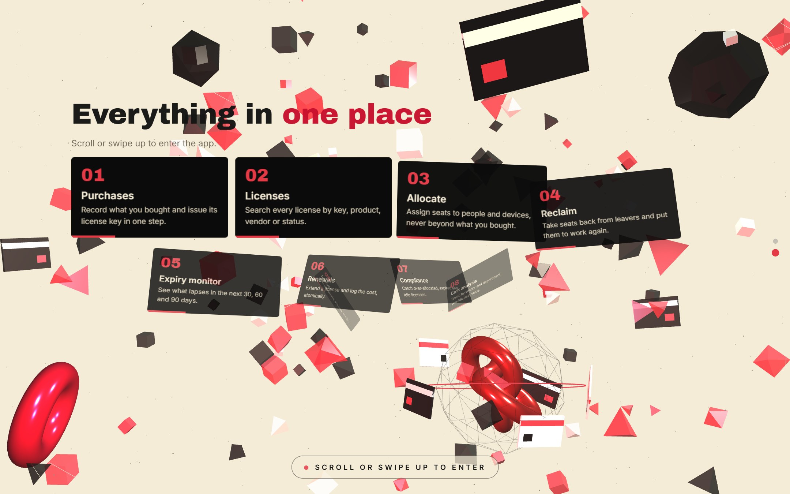


## 11.3 Home page and role-based navigation

The Home page greets the user, shows five live figures from the database and then a "toolkit" card for every page the user's role can open. Tapping a card jumps straight to that page.

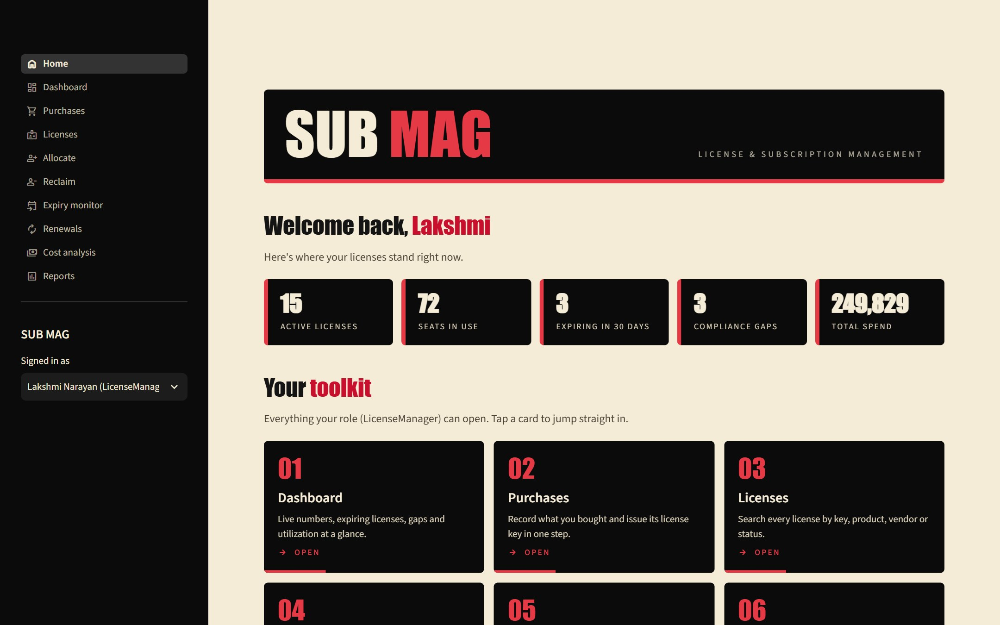

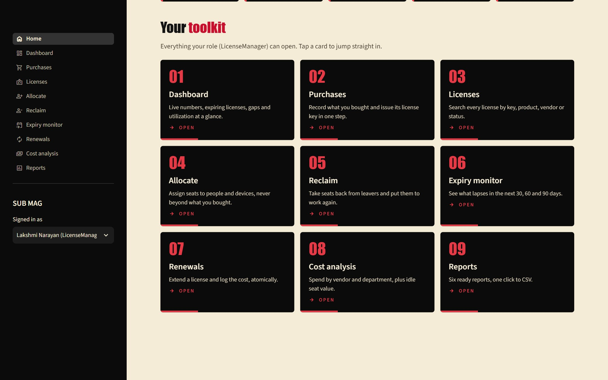


## 11.4 Application pages

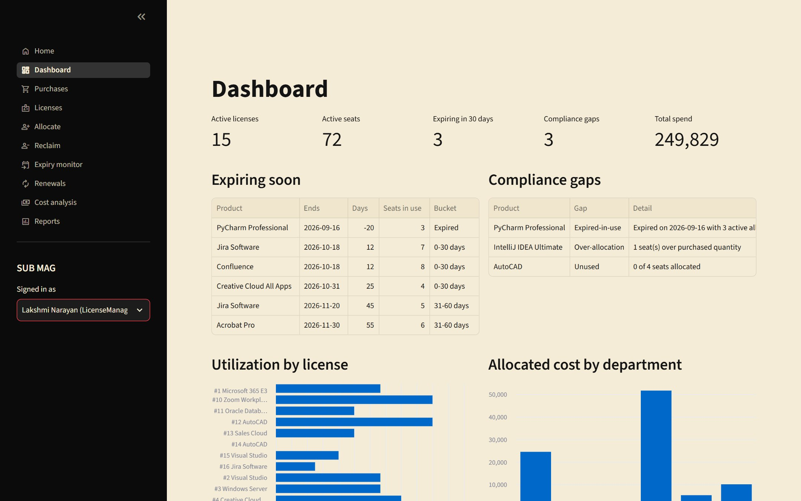

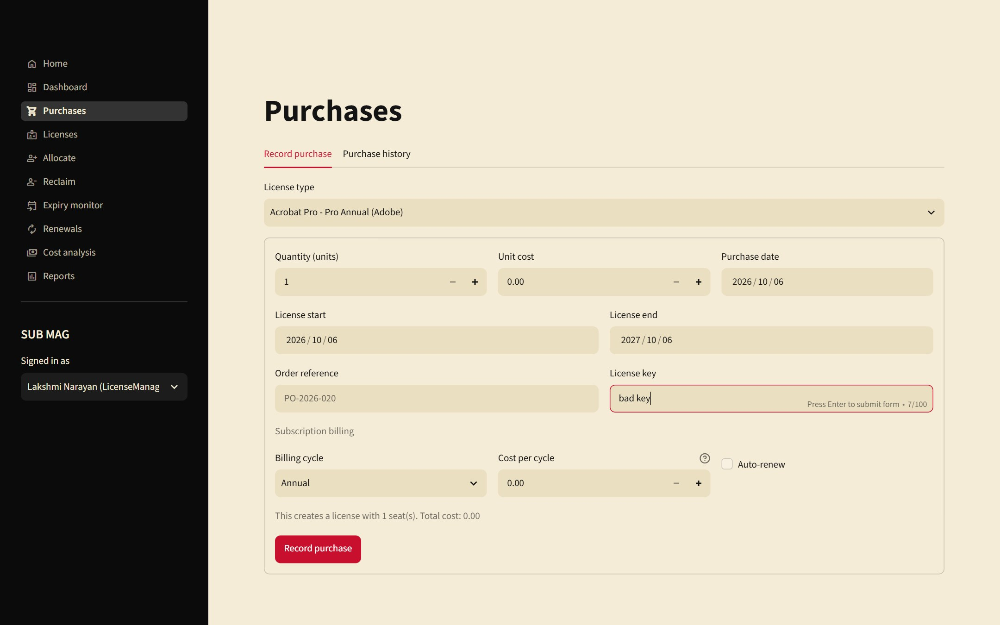


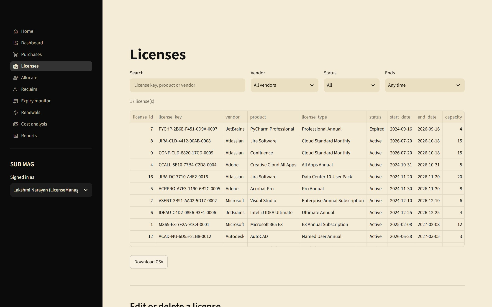

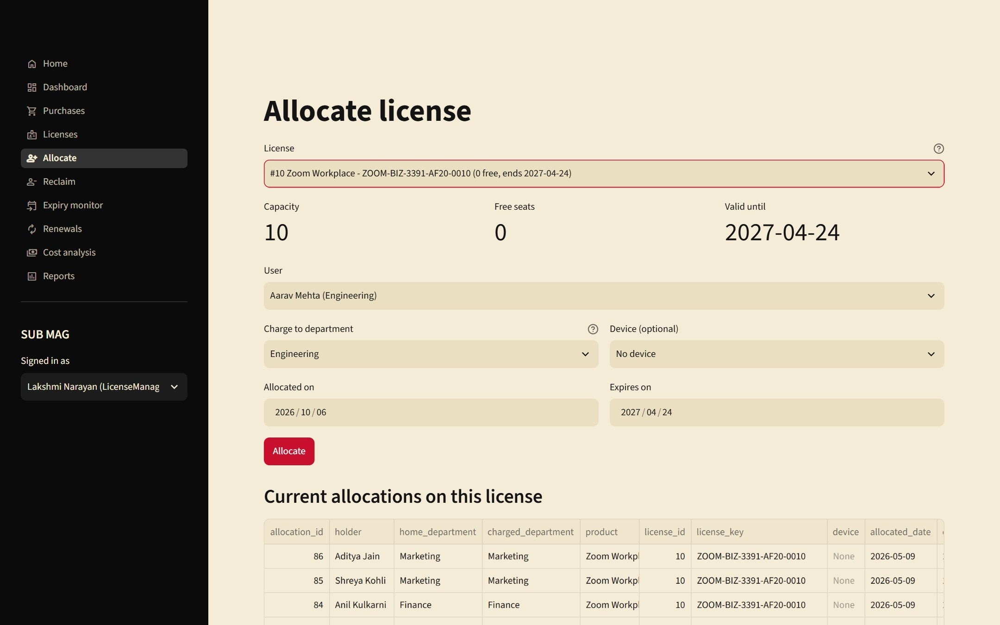


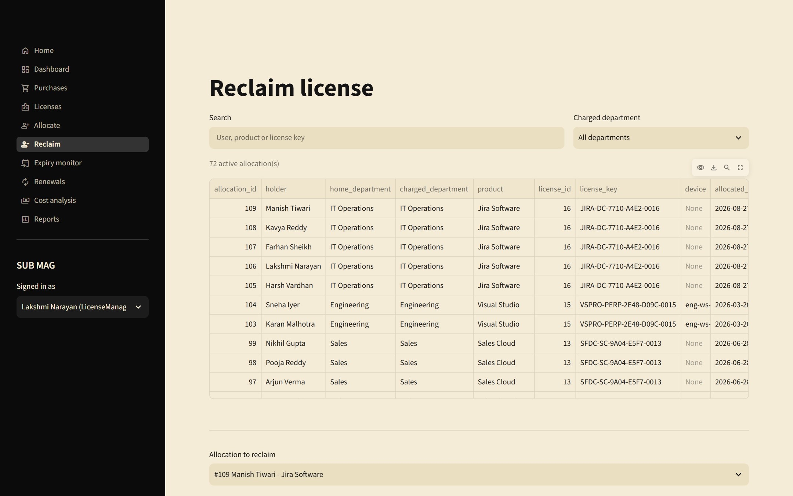

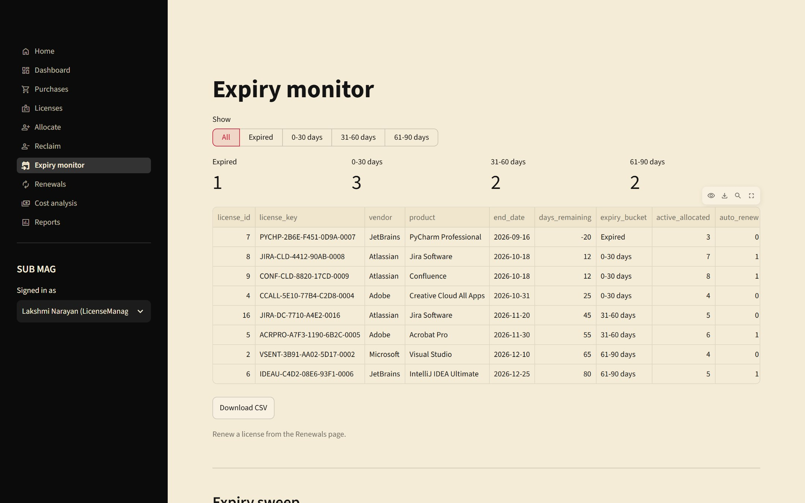

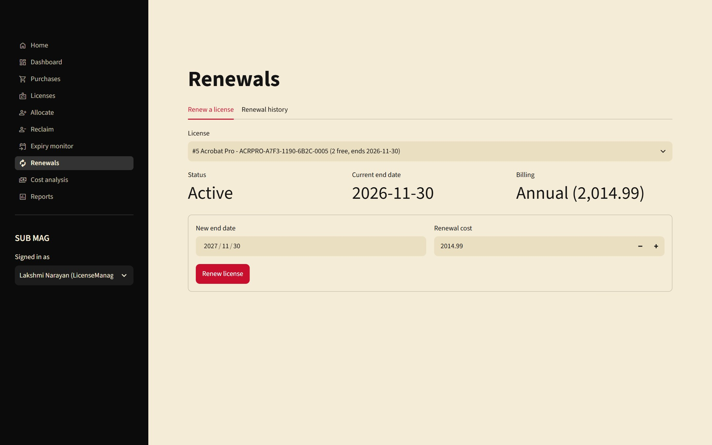

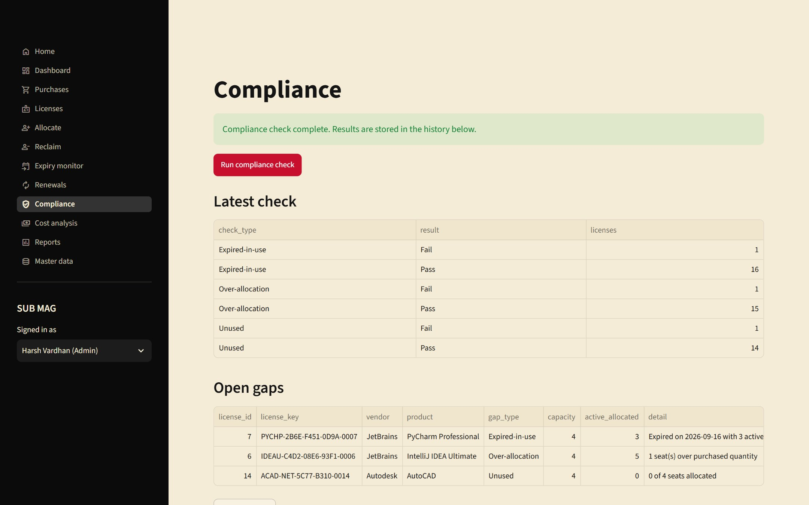


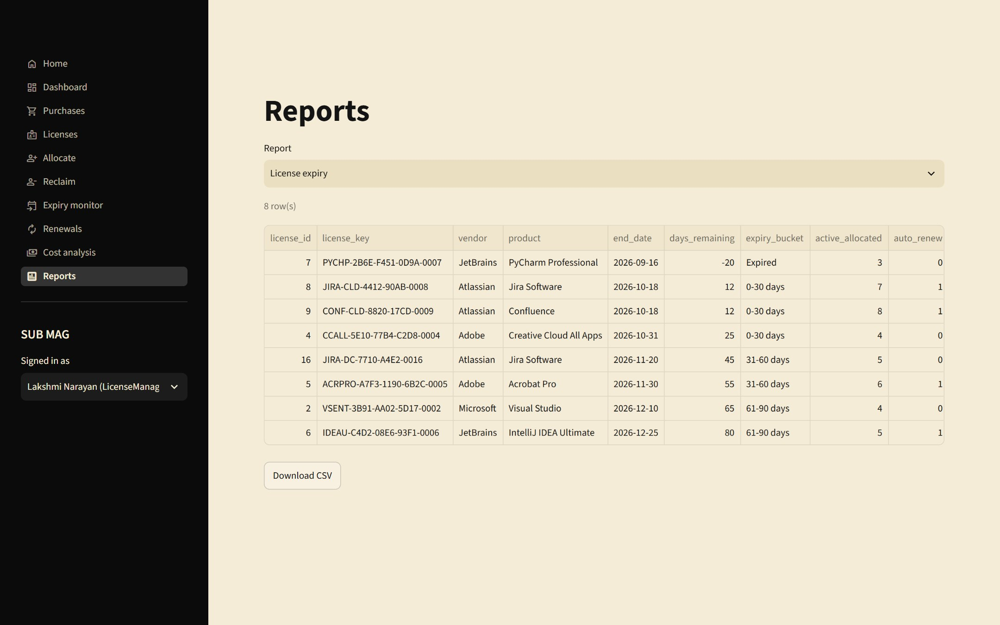

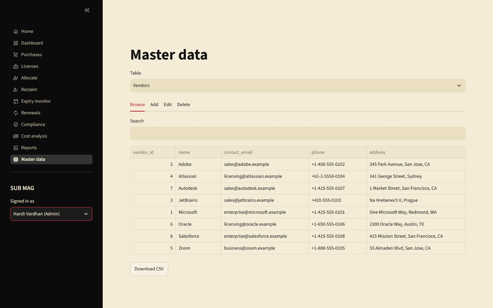

---

# 12. Implementation Details

## 12.1 Technology stack

| Layer | Technology | Responsibility |
|---|---|---|
| Presentation | Streamlit 1.65 (Python), Three.js for the introduction | Pages, forms, tables, charts, role-based navigation |
| Application services | Python modules in `Presentation/app/services/` | Business operations, transactions, validation |
| Data access | `mysql-connector-python` through `Presentation/app/db.py` | Connections, transactions, error translation |
| Database | MySQL 8.0 (InnoDB) | Storage, constraints, triggers, views, stored procedures |

Size of the implementation:

| Part | Files | Lines |
|---|---|---|
| Python application (`Presentation/app/`) | 28 | 1957 |
| SQL scripts (`Presentation/sql/`) | 6 | 1070 |

## 12.2 Project structure

```text
DBMS_COURSE_PROJECT/                 (GitHub repository)
├── Report/
│   ├── README.md                    guide to this folder
│   ├── PROJECT_REPORT.md            this report (Markdown source)
│   ├── PROJECT_REPORT.docx          this report (Word)
│   └── images/                      ER diagram and screenshots used in the report
└── Presentation/                    complete codebase and supporting documents
    ├── app/
    │   ├── main.py                  entry point: introduction, sign-in, role-based navigation
    │   ├── config.py                reads database settings from .env
    │   ├── db.py                    connections, transactions, error translation
    │   ├── validators.py            input validation
    │   ├── services/                purchases, licenses, allocations, renewals, compliance, reports, master, lookups
    │   ├── views/                   one module per page, plus the introduction (splash.py)
    │   └── .streamlit/config.toml   red, black and cream theme
    ├── sql/                         01_schema, 02_indexes, 03_seed_data, 04_queries, 05_views, 06_procedures
    └── docs/                        requirements, ER diagram, normalization, data dictionary
```

## 12.3 Database connectivity

Connection settings come from environment variables (loaded from `Presentation/app/.env`), so no password is stored in the code.

```python
DB = {
    "host": os.getenv("DB_HOST", "127.0.0.1"),
    "port": int(os.getenv("DB_PORT", "3306")),
    "user": os.getenv("DB_USER", "root"),
    "password": os.getenv("DB_PASSWORD", ""),
    "database": os.getenv("DB_NAME", "license_mgmt"),
}
```

`db.py` provides three building blocks: `query()` for reads, `transaction()` for multi-step writes, and `call_procedure()` for stored procedures. Values are always passed as bound parameters, never concatenated into SQL.

## 12.4 Key code snippets

### Transactions

Every multi-step write runs inside `transaction()`. It commits when the block finishes and rolls back everything if any step fails.

```python
@contextmanager
def transaction():
    """Yield a cursor; commit on success, roll back everything on any error."""
    conn = connect()
    try:
        cur = conn.cursor(dictionary=True)
        yield cur
        conn.commit()
    except Error as e:
        conn.rollback()
        raise translate(e) from e
    except Exception:
        conn.rollback()
        raise
    finally:
        conn.close()
```

### Turning database errors into user-friendly messages

Trigger messages and constraint violations are translated into plain sentences, so the user never sees a raw database error.

```python
def translate(err: Error) -> AppError:
    """Turn a driver error into a message a user can act on."""
    msg = err.msg or str(err)
    if err.errno == 1644:  # SIGNAL from a business-rule trigger
        return AppError(msg)
    if err.errno in (1062, 3819):
        m = re.search(r"key '(?:\w+\.)?(\w+)'", msg) or re.search(r"constraint '(\w+)'", msg)
        if m and m.group(1) in CONSTRAINT_MESSAGES:
            return AppError(CONSTRAINT_MESSAGES[m.group(1)])
        return AppError("That value conflicts with an existing record or violates a data rule.")
    if err.errno == 1451:
        return AppError("This record is still referenced by other records, so it can't be deleted.")
    if err.errno == 1452:
        return AppError("A selected related record doesn't exist.")
    if err.errno in (1048, 1364):
        return AppError("A required field is missing.")
    if err.errno in (2003, 2002, 1045, 1049):
        return AppError("Can't connect to the database. Check the DB settings in app/.env and that MySQL is running.")
    return AppError(f"Database error: {msg}")
```

### Recording a purchase (purchase, license and subscription together)

If the license key is a duplicate, the purchase row is rolled back too, so no orphan purchase is left behind.

```python
def record_purchase(license_type_id, quantity, unit_cost, purchase_date, order_reference,
                    license_key, start_date, end_date, billing_cycle=None, auto_renew=False,
                    cost_per_cycle=None):
    """Create purchase + license (+ subscription) atomically. Returns ids."""
    order_reference = v.clean(order_reference)
    license_key = v.clean(license_key)
    billing_cycle = v.clean(billing_cycle)
    v.validate_purchase(license_type_id, quantity, unit_cost, purchase_date, order_reference,
                        license_key, start_date, end_date, billing_cycle, cost_per_cycle)

    with db.transaction() as cur:
        cur.execute("SELECT seats_per_license FROM license_type WHERE license_type_id = %s",
                    (license_type_id,))
        lt = cur.fetchone()
        if not lt:
            raise db.AppError("That license type no longer exists.")

        cur.execute("""INSERT INTO purchase (license_type_id, quantity, unit_cost, purchase_date, order_reference)
                       VALUES (%s, %s, %s, %s, %s)""",
                    (license_type_id, quantity, unit_cost, purchase_date, order_reference))
        purchase_id = cur.lastrowid

        key = license_key or generate_key()
        cur.execute("""INSERT INTO license (purchase_id, license_key, quantity, start_date, end_date)
                       VALUES (%s, %s, %s, %s, %s)""",
                    (purchase_id, key, quantity * lt["seats_per_license"], start_date, end_date))
        license_id = cur.lastrowid

        if billing_cycle:
            cur.execute("""INSERT INTO subscription (license_id, billing_cycle, auto_renew, cost_per_cycle)
                           VALUES (%s, %s, %s, %s)""",
                        (license_id, billing_cycle, bool(auto_renew), cost_per_cycle))
    return {"purchase_id": purchase_id, "license_id": license_id, "license_key": key,
            "seats": quantity * lt["seats_per_license"]}
```

### Allocating a license

The service only validates input and inserts. The quantity, expiry and validity-window rules are enforced by the database trigger, so they cannot be bypassed.

```python
def allocate(license_id, user_id, device_id, department_id, allocated_date, expiry_date):
    v.validate_allocation(license_id, user_id, department_id, allocated_date, expiry_date)
    with db.transaction() as cur:
        cur.execute("""INSERT INTO allocation (license_id, user_id, device_id, department_id,
                                               allocated_date, expiry_date)
                       VALUES (%s, %s, %s, %s, %s, %s)""",
                    (license_id, user_id, device_id, department_id, allocated_date, expiry_date))
        return cur.lastrowid
```

### Renewing a license

The license row is locked, the renewal is logged with the previous end date, and the end date is extended in the same transaction.

```python
def renew_license(license_id, new_end_date, cost, renewed_by, renewal_date=None):
    """Extend a license and log the renewal in one transaction."""
    v.validate_renewal(license_id, new_end_date, cost)
    with db.transaction() as cur:
        cur.execute("SELECT end_date, status FROM license WHERE license_id = %s FOR UPDATE", (license_id,))
        lic = cur.fetchone()
        if not lic:
            raise db.AppError("That license no longer exists.")
        if lic["status"] == "Revoked":
            raise db.AppError("A revoked license can't be renewed. Change its status first.")
        if new_end_date <= lic["end_date"]:
            raise db.AppError(f"The new end date must be after the current end date ({lic['end_date']}).")
        cur.execute("""INSERT INTO renewal (license_id, renewal_date, previous_end_date, new_end_date,
                                            renewal_cost, renewed_by)
                       VALUES (%s, COALESCE(%s, CURDATE()), %s, %s, %s, %s)""",
                    (license_id, renewal_date, lic["end_date"], new_end_date, cost, renewed_by))
        renewal_id = cur.lastrowid
        cur.execute("UPDATE license SET end_date = %s, status = 'Active' WHERE license_id = %s",
                    (new_end_date, license_id))
        return renewal_id
```

### Input validation

```python
def validate_renewal(license_id, new_end_date, cost):
    e = []
    if not license_id:
        e.append("Select a license.")
    if not isinstance(new_end_date, date):
        e.append("Enter the new end date.")
    if cost is None or cost <= 0:
        e.append("Renewal cost must be greater than zero.")
    elif cost > 100_000_000:
        e.append("Renewal cost looks too large. Check the amount.")
    _raise(e)
```

### Role-based navigation

```python
ROLE_PAGES = {
    "Admin": list(PAGES),
    "LicenseManager": ["home", "dashboard", "purchases", "licenses", "allocate", "reclaim",
                       "expiry", "renewals", "cost", "reports"],
    "Compliance": ["home", "dashboard", "licenses", "expiry", "compliance", "cost", "reports"],
    "Manager": ["home", "dashboard", "cost", "reports"],
    "Employee": ["home", "dashboard"],
}
```

## 12.5 Running the system

```text
From the Presentation folder:
1. mysql -u root -p < sql/01_schema.sql        (repeat for 02, 03, 05, 06)
2. cd app
3. copy .env.example .env                       (then put the MySQL password in .env)
4. pip install -r requirements.txt
5. streamlit run main.py                        (opens http://localhost:8501)
```

---

# 13. Testing

## 13.1 Test strategy

Testing was done at three levels, all run against a real MySQL 8.0 instance loaded with the sample data:

1. **Database level.** SQL statements that deliberately break each constraint and business rule, checking that the database refuses them with the expected error.
2. **Service level.** A Python script calls the application's service functions directly, covering the success paths, the failure paths, validation and transaction rollback.
3. **User-interface level.** Streamlit's headless test harness renders every page for every role and performs real interactions (selecting items, filling forms, clicking buttons) and checks the messages shown.

Because the sample data is generated relative to the run date, the tests are repeatable on any day. The database was reloaded from the seed scripts before each test run.

## 13.2 Summary of results

| Test level | Test cases | Passed | Failed |
|---|---|---|---|
| Database rules and constraints (SQL) | 14 | 14 | 0 |
| Service layer (Python, against MySQL) | 59 | 59 | 0 |
| User-interface interactions (Streamlit) | 17 | 17 | 0 |
| **Total** | 90 | 90 | 0 |

All test cases passed.

## 13.3 Database rule and constraint tests

Each row is a statement that the database is expected to refuse. "Pass" means it was refused with the response shown.

| ID | Attempted operation | Database response | Result |
|---|---|---|---|
| BR1 | Duplicate license key | `ERROR 1062: Duplicate entry 'M365-E3-7F2A-91C4-0001' for key 'license.uq_license_key'` | Pass |
| BR2 | Allocate beyond purchased quantity (license 10 is full) | `ERROR 1644: Allocation exceeds purchased quantity for this license` | Pass |
| BR3a | Expiry date not after allocation date | `ERROR 3819: Check constraint 'chk_alloc_period' is violated.` | Pass |
| BR3b | Allocation period outside the license window | `ERROR 1644: Allocation period must lie within the license validity window` | Pass |
| BR4a | Assign an expired license | `ERROR 1644: Cannot allocate an expired or revoked license` | Pass |
| BR4b | Assign a revoked license | `ERROR 1644: Cannot allocate an expired or revoked license` | Pass |
| BR5 | Renewal cost of zero | `ERROR 3819: Check constraint 'chk_renewal_cost' is violated.` | Pass |
| BR6 | Same user gets a second active seat on a license | `ERROR 1062: Duplicate entry '1-1' for key 'allocation.uq_active_seat'` | Pass |
| C1 | Negative purchase quantity | `ERROR 3819: Check constraint 'chk_purchase_qty' is violated.` | Pass |
| C2 | Invalid email format for a vendor | `ERROR 3819: Check constraint 'chk_vendor_email' is violated.` | Pass |
| C3 | License end date before start date | `ERROR 3819: Check constraint 'chk_license_dates' is violated.` | Pass |
| C4 | Invalid status value | `ERROR 3819: Check constraint 'chk_license_status' is violated.` | Pass |
| C5 | Foreign key to a missing record | `ERROR 1452: Cannot add or update a child row: a foreign key constraint fails (`license_mgmt`.`allocation`, CONSTRAINT `fk_alloc_user` FOREIGN KEY (`user_id`) REFERENCES `app_user` (`user_id`))` | Pass |
| C6 | Delete a vendor that still has products | `ERROR 1451: Cannot delete or update a parent row: a foreign key constraint fails (`license_mgmt`.`software_product`, CONSTRAINT `fk_product_vendor` FOREIGN KEY (`vendor_id`) REFERENCES `vendor` (`vendor_id`))` | Pass |

## 13.4 Service-layer test cases

| ID | Service-layer test case | Result |
|---|---|---|
| S-01 | purchase creates license with generated key | Pass |
| S-02 | subscription row created | Pass |
| S-03 | duplicate license key rejected | Pass |
| S-04 | failed purchase rolled back (no orphan purchase) | Pass |
| S-05 | duplicate order reference rejected | Pass |
| S-06 | negative quantity validated | Pass |
| S-07 | end before start validated | Pass |
| S-08 | bad key format validated | Pass |
| S-09 | list_purchases search | Pass |
| S-10 | allocate succeeds | Pass |
| S-11 | same user twice rejected | Pass |
| S-12 | over quantity rejected (capacity 3) | Pass |
| S-13 | period outside license window rejected | Pass |
| S-14 | expired license rejected | Pass |
| S-15 | revoked license rejected | Pass |
| S-16 | expiry before allocation validated | Pass |
| S-17 | reclaim frees seat | Pass |
| S-18 | reclaim twice rejected | Pass |
| S-19 | freed seat can be reused | Pass |
| S-20 | list_allocations filter | Pass |
| S-21 | renewal cost zero rejected | Pass |
| S-22 | renewal not extending rejected | Pass |
| S-23 | renewal extends license | Pass |
| S-24 | renewal logged with previous end | Pass |
| S-25 | revoked renewal rejected | Pass |
| S-26 | renewing expired license reactivates it | Pass |
| S-27 | compliance run produces summary | Pass |
| S-28 | gaps detected (over-allocation, unused) | Pass |
| S-29 | rerun same day is idempotent | Pass |
| S-30 | compliance history filter | Pass |
| S-31 | expiry sweep expires license and allocations | Pass |
| S-32 | search by text | Pass |
| S-33 | search expiring within 30 | Pass |
| S-34 | update license | Pass |
| S-35 | update with dup key rejected | Pass |
| S-36 | delete license with history rejected | Pass |
| S-37 | delete clean license works | Pass |
| S-38 | report License expiry | Pass |
| S-39 | report Utilization | Pass |
| S-40 | report Compliance gaps | Pass |
| S-41 | report Renewal cost | Pass |
| S-42 | report Department allocation | Pass |
| S-43 | report Vendor portfolio | Pass |
| S-44 | kpis | Pass |
| S-45 | idle spend | Pass |
| S-46 | renewal forecast | Pass |
| S-47 | spend by product | Pass |
| S-48 | master update | Pass |
| S-49 | master dup name | Pass |
| S-50 | master bad email | Pass |
| S-51 | master required | Pass |
| S-52 | master delete referenced | Pass |
| S-53 | master delete | Pass |
| S-54 | master list Vendors | Pass |
| S-55 | master list Products | Pass |
| S-56 | master list License types | Pass |
| S-57 | master list Departments | Pass |
| S-58 | master list Users | Pass |
| S-59 | master list Devices | Pass |

## 13.5 User-interface test cases

In addition to the cases below, every page was rendered for each of the four main roles (Admin, License manager, Compliance, Manager), 48 page renders in total, with no errors; and the Home page was verified to show exactly the expected number of cards for each of the five roles (Admin 11, License manager 9, Compliance 6, Manager 3, Employee 1).

| ID | UI interaction test case | Result |
|---|---|---|
| U-01 | allocate on full license shows quantity error | Pass |
| U-02 | allocate success shows flash | Pass |
| U-03 | duplicate seat error | Pass |
| U-04 | purchase duplicate key error | Pass |
| U-05 | purchase invalid key validation | Pass |
| U-06 | purchase valid submit succeeds (perpetual) | Pass |
| U-07 | subscription purchase defaults cost per cycle | Pass |
| U-08 | renewal cost 0 rejected | Pass |
| U-09 | reclaim without confirm blocked | Pass |
| U-10 | reclaim with confirm succeeds | Pass |
| U-11 | compliance run flash | Pass |
| U-12 | expiry sweep runs | Pass |
| U-13 | allocate read-only for Compliance role | Pass |
| U-14 | reclaim read-only for Compliance role | Pass |
| U-15 | purchases read-only for Compliance role | Pass |
| U-16 | renewals read-only for Compliance role | Pass |
| U-17 | master data invalid email | Pass |

## 13.6 Index usage

An `EXPLAIN` of the expiry query shows that the optimizer uses the index on `license(end_date, status)`: the access type is `range` and the chosen key is `idx_license_end_status`, so only the licenses inside the date window are read instead of scanning the whole table. A second run with `FORCE INDEX` produces the same access path (the estimated row count differs only because the optimizer's estimates are approximate).

```sql
EXPLAIN SELECT license_id, license_key, end_date FROM license WHERE status = 'Active' AND end_date BETWEEN CURDATE() AND CURDATE() + INTERVAL 30 DAY;
```

| id | table | type | possible_keys | key | rows | Extra |
|---|---|---|---|---|---|---|
| 1 | license | range | idx_license_end_status | idx_license_end_status | 3 | Using index condition |

```sql
EXPLAIN SELECT license_id, license_key, end_date FROM license FORCE INDEX (idx_license_end_status) WHERE status = 'Active' AND end_date BETWEEN CURDATE() AND CURDATE() + INTERVAL 30 DAY;
```

| id | table | type | possible_keys | key | rows | Extra |
|---|---|---|---|---|---|---|
| 1 | license | range | idx_license_end_status | idx_license_end_status | 1 | Using index condition |

## 13.7 Observations

- Rule violations are caught at the database even when the application is bypassed, which is the intended behaviour of the design.
- A failed purchase (duplicate key) leaves no orphan purchase row, confirming that the transaction rolls back.
- The tests exposed one usability gap during development: for subscription purchases the cost per billing cycle had to be retyped. It was fixed by defaulting it to the total purchase cost and then re-tested.

---

# 14. Conclusion and Future Enhancements

## 14.1 Conclusion

The project delivers a complete license and subscription management system: a normalized (3NF/BCNF) MySQL database with twelve tables, a full set of integrity constraints, two triggers and two stored procedures that enforce the five required business rules inside the database, six reporting views, ten supporting indexes, realistic sample data, a library of 36 queries and a Streamlit application with role-based access. All 90 automated test cases passed. The system shows that putting integrity rules in the database, rather than only in application code, keeps the data correct no matter how it is accessed, and that views and procedures keep the reporting and maintenance logic simple and reusable.

## 14.2 Limitations

- Users are chosen from a list rather than signing in with a password.
- Each purchase creates one license; splitting a purchase into several licenses is not supported yet.
- A single currency is assumed.
- Because the allocation trigger locks the license row (`FOR UPDATE`), MySQL refuses an allocation statement that also reads the `license` table in a subquery (error 1442). Allocations are therefore created with explicit values, which is what the application does.
- The 3D introduction needs an internet connection the first time (Three.js and fonts are loaded from a CDN) and was tested on desktop Chrome only.
- Automated tests are scripts run by hand rather than part of a continuous integration pipeline.

## 14.3 Future enhancements

1. Real authentication (hashed passwords or single sign-on) and per-role database accounts.
2. E-mail or chat alerts for licenses nearing expiry and for new compliance gaps.
3. Bulk import of purchases, users and devices from CSV files.
4. An audit trail table recording who changed which allocation, renewal or license and when.
5. Automatic discovery of installed software on devices to compare with allocations.
6. Multi-currency support and exchange-rate-aware cost reports.
7. A REST API so other tools can read and update the data.
8. Packaging with Docker and a CI pipeline that runs the automated tests on every change.
9. A mobile-friendly layout and an offline-capable introduction (bundled graphics library and fonts).

---

# 15. References

1. R. Elmasri and S. B. Navathe, *Fundamentals of Database Systems*, 7th ed., Pearson, 2016.
2. A. Silberschatz, H. F. Korth and S. Sudarshan, *Database System Concepts*, 7th ed., McGraw-Hill, 2019.
3. C. J. Date, *An Introduction to Database Systems*, 8th ed., Pearson, 2003.
4. Oracle Corporation, *MySQL 8.0 Reference Manual* (CHECK constraints, triggers, stored procedures, generated columns, window functions), https://dev.mysql.com/doc/refman/8.0/en/
5. Streamlit Inc., *Streamlit Documentation*, https://docs.streamlit.io
6. Oracle Corporation, *MySQL Connector/Python Developer Guide*, https://dev.mysql.com/doc/connector-python/en/
7. Python Software Foundation, *Python 3 Documentation*, https://docs.python.org/3/
8. pandas development team, *pandas Documentation*, https://pandas.pydata.org/docs/
9. Three.js authors, *Three.js Documentation*, https://threejs.org/docs/
10. Course lecture notes and laboratory manual, Database Management Systems, [Institute name].


# 16. Appendix

## Appendix A: GitHub repository link

https://github.com/Maze006/DBMS_COURSE_PROJECT

## Appendix B: Project files

| File | Content |
|---|---|
| `Presentation/docs/requirements.md` | Problem statement, scope, users and requirements |
| `Presentation/docs/er-diagram.svg` | ER diagram |
| `Presentation/docs/initial-schema.md` | First-draft schema before normalization |
| `Presentation/docs/normalization.md` | Functional dependencies and 3NF analysis |
| `Presentation/docs/data-dictionary.md` | Table structures |
| `Presentation/sql/01_schema.sql` … `06_procedures.sql` | Database scripts |
| `Presentation/app/` | The SUB MAG application |
| `Report/PROJECT_REPORT.md` | This report |
